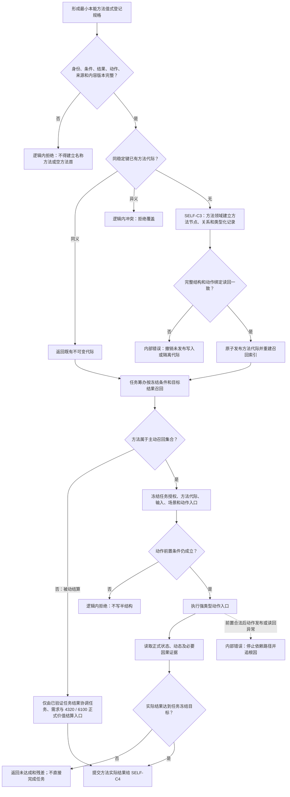

# MINIMAL-INSTINCT：最小本能方法集登记执行施工流程图 v0.1

更新时间：2026-07-23

## 依据

- `规范/3300_根规范_方法_20260720.md`
- `规范/5300_子规范_方法登记选择与执行规则_20260720.md`
- `规范/5310_子规范_本能方法自身环境就绪_20260720.md`
- `规范/5320_子规范_本能函数实现与返回边界_20260720.md`
- `规范/5330_子规范_学习相关本能函数边界_20260720.md`
- `规范/8210_子规范_自我动作验证闭环_20260720.md`
- `规范/详细设计/最小本能方法集登记与执行详细设计.md`
- `计划/20260723_SELF-D0_节点直接自我治理闭环设计链重建计划_v0.1.md`

## 施工元数据

| 项 | 冻结内容 |
| --- | --- |
| 图类型 | 待实施目标流程图；不是当前代码流程 |
| 绑定详细设计 | `规范/详细设计/最小本能方法集登记与执行详细设计.md` |
| 绑定计划 | #353 设计计划；后继 #356 |
| 允许文件 | SELF-C3 合同和 #356 叶子计划最终白名单 |
| 禁止文件 | 任务 / 需求 / 价值事实直接写入、生产装配、工程、入口和其它领域私有文件 |
| 预期结构变化 | 登记十个稳定方法身份及条件、结果、动作、内容版本和实际回读合同 |
| 执行前复核 | 核对最小方法清单、被动结算隔离、5330 三类学习输入和动作入口所有权 |
| 验证方式 | 同义登记、异义拒绝、主动 / 被动召回、实际回读、三类学习输入分流和恢复不自增 |
| 不得宣称 | 方法已登记不等于任务、需求、价值或连续治理闭环已完成 |

## 身份与边界

本图冻结 `SELF-C3 / v0.1`。它是正式施工设计图，但不证明代码已实现。方法必须有稳定身份、条件、结果、动作、内容版本和回读边界；无候选时不得自动创建方法首。

## 关键边界

1. 最小集包含同步运行态、改变自我实例特征、进入待机、退出待机、重置时序、结算合法任务结果、故障收口、尝试学习、定向学习和练习方法。
2. 改变自我实例特征仅作用于已冻结自我治理目标。
3. 被动结算方法不进入主动召回。
4. 方法动作成功不等于任务完成；实际回读进入 SELF-C4。
5. 恢复不自动登记、选择、执行或晋级方法。
6. 尝试学习、定向学习和练习严格按 5330 的不同输入前提分流；4330 的待结算观察不得进入效果统计。
