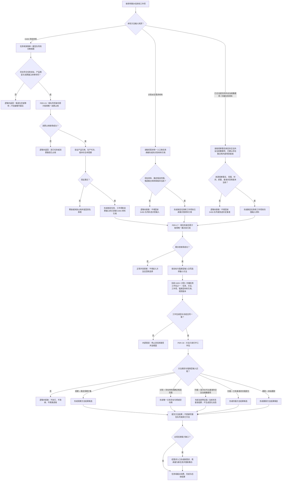

# PERIPHERAL-TASK：任务唯一消费冻结工作包观察方法施工流程图 v0.1

更新时间：2026-07-23

## 依据

- `规范/3200_根规范_任务_20260720.md`
- `规范/3300_根规范_方法_20260720.md`
- `规范/5230_子规范_任务筹办与执行边界_20260720.md`
- `规范/5300_子规范_方法登记选择与执行规则_20260720.md`
- `规范/6320_子规范_外设观察特征与自我场景认知分层_20260720.md`
- `规范/6340_子规范_外设独立控制线程与消息承接边界_20260720.md`
- `规范/6350_子规范_双目相机外设独占观察线程_20260720.md`
- `规范/6360_子规范_相机外设综合工作流程_20260720.md`
- `规范/6370_子规范_识别本能方法唯一性收敛_20260720.md`
- `规范/详细设计/D455任务唯一消费冻结工作包与观察方法详细设计.md`
- `计划/20260723_PERCEPTION-D0_D455观察体素生产闭环设计链重建计划_v0.1.md`

## 施工元数据

| 项 | 冻结内容 |
| --- | --- |
| 图类型 | 待实施目标流程图；不是当前代码流程 |
| 绑定详细设计 | `规范/详细设计/D455任务唯一消费冻结工作包与观察方法详细设计.md` |
| 绑定计划 | #360 设计计划；后继 #366—#368 代码计划 |
| 允许文件 | 唯一读取绑定详细设计第 2 节中归属 #366—#368 的精确新建文件；只读消费 #362 队列和现有任务 / 方法入口 |
| 禁止文件 | 报告提供者、外设算法、存在 / 场景 / 状态 / 动态提交、工程、入口、生产宿主 |
| 预期结构变化 | 新建唯一承接引用、任务级筹办占用绑定、D455 / 识别 / 扫描三类任务工作包和四方法强类型结果 |
| 执行前复核 | 核对 PER-C2 / C5、SELF-C2 / C3、PER-C6—C8 ABI、任务身份并发键、三类工作包和零方法直调 |
| 验证方式 | 同报告一次承接、同任务召回前互斥、跨任务并发、工作包冻结、识别无 D455 直通和恢复重筹办 |
| 不得宣称 | 工作包或方法候选通过不证明世界事实、任务完成、真实外设接通或闭环完成 |

## 身份与边界

本图冻结 `PER-C6—PER-C8 / v0.1`。任务域是 D455 报告的唯一正式消费者。同一任务只有一个有效筹办执行权；冻结方法只能读取绑定到该任务、工作项和消费窗口的已承接材料引用。观察、识别、扫描、跟踪四类方法不能直接互调。

## 关键边界

1. 消费占用按队列项或消费窗口隔离；筹办执行权按任务身份隔离，两者不能混用。
2. 同一任务的第二条筹办路径必须在召回前被挡住；两条路径同时进入召回属于内部并发规则破坏。
3. 工作包冻结后不得改绑任务、方法、工作项、材料或消费窗口；重试必须验证同义身份和版本。
4. 观察消费稳定观察子集；已有基准的扫描消费扫描变化；首次扫描只消费观察方法 / 提交入口已经形成的合法外设当前数据项；跟踪消费目标跟踪。原始逐簇禁止进入业务方法。
5. 识别没有 D455 产品直通。它只消费由前一方法结果形成、经需求统一入口和新任务承接后冻结的“存在材料 + 确定候选范围”工作包；不得用原始逐簇、稳定观察子集或报告队列项冒充。
6. 方法结果或缺口必须通过“结构化材料 -> 需求统一入口 -> 新任务 -> 新筹办轮次”衔接，四类方法不得互相直接调用。
