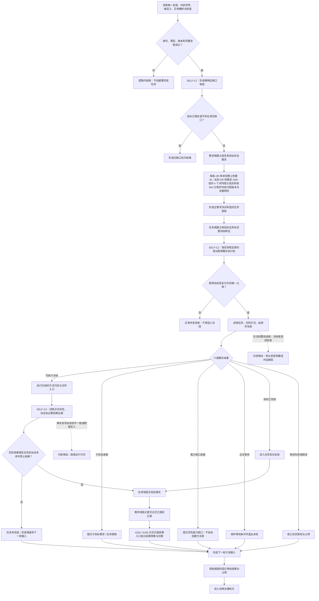

# SELF-GOVERNANCE：节点直接自我内部治理闭环施工流程图 v0.1

更新时间：2026-07-23

## 依据

- `规范/3100_根规范_需求_20260720.md`
- `规范/3200_根规范_任务_20260720.md`
- `规范/3300_根规范_方法_20260720.md`
- `规范/5110_子规范_需求树生长机制_20260720.md`
- `规范/5160_子规范_需求正式结算记录与唯一结论.md`
- `规范/5200_子规范_任务根据需求初始化_20260720.md`
- `规范/5230_子规范_任务筹办与执行边界_20260720.md`
- `规范/6130_子规范_自我根特征抽象定义与自检缺口_20260720.md`
- `规范/8210_子规范_自我动作验证闭环_20260720.md`
- `规范/详细设计/节点直接自我内部治理闭环详细设计.md`
- `计划/20260723_SELF-D0_节点直接自我治理闭环设计链重建计划_v0.1.md`

## 施工元数据

| 项 | 冻结内容 |
| --- | --- |
| 图类型 | 待实施目标流程图；不是当前代码流程 |
| 绑定详细设计 | `规范/详细设计/节点直接自我内部治理闭环详细设计.md` |
| 绑定计划 | #353 设计计划；后继 #354、#355、#357 |
| 允许文件 | 唯一读取绑定详细设计第 4 节 SELF-C1、SELF-C2、SELF-C4 精确合同文件及各叶子计划白名单 |
| 禁止文件 | 方法登记 / 学习 / 运行装配私有文件、工程、入口和表外领域文件 |
| 预期结构变化 | 根缺口、需求路径、任务意图、任务级筹办占用、六类结果、事实回读和三类独立裁决 |
| 执行前复核 | 核对 OR/AND 权重、任务身份并发键、恢复代次、六类结果和正式结算入口 |
| 验证方式 | 权重闭合、同任务互斥 / 跨任务并行、六类覆盖、事实回读、任务 / 需求 / 价值分账和恢复 |
| 不得宣称 | 流程图、合同或单轮自检不证明生产治理循环、苏醒或成熟完成 |

## 身份与边界

本图冻结 `SELF-C1、SELF-C2、SELF-C4 / v0.1` 的主链。它是正式施工设计图，但不证明代码已实现。自检候选、线程、返回码、日志和组合投影都不承担需求、任务、方法、事实或结算身份。

## 关键边界

1. 同一任务只有取得筹办占用的路径能进入召回；不同任务可并行。
2. “无确认路径”不是第七类结果，必须归入六类闭合。
3. 方法执行报告不能替代实际事实回读。
4. 任务完成、需求满足和价值结算分别写入、分别读回。
5. 旧运行代次占用不跨恢复继承；外部动作未证实收口时只能合法等待。
6. AND 只属于一个确定 OR，禁止任意“规范化份额”；余量规则未冻结时不得发布分配结果。
