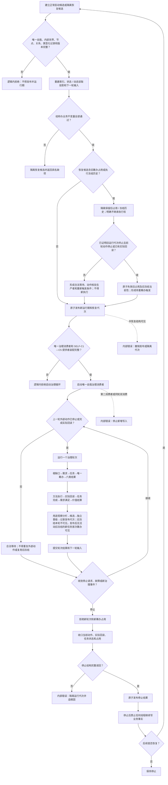

# SELF-RUNTIME：生产自我治理多轮运行施工流程图 v0.1

更新时间：2026-07-23

## 依据

- `规范/4070_子规范_权威结构快照恢复候选与运行期原子发布.md`
- `规范/7130_子规范_自我内部世界成员特征与事实读取投影.md`
- `规范/8100_子规范_自我线程与任务管理线程权责边界_20260720.md`
- `规范/8200_子规范_自我内部循环实现_20260720.md`
- `规范/8300_子规范_自我内部循环最小生命闭环验收_20260720.md`
- `规范/8310_子规范_自我苏醒阶段验收_20260720.md`
- `规范/详细设计/生产自我治理循环装配与验收详细设计.md`
- `计划/20260723_SELF-D0_节点直接自我治理闭环设计链重建计划_v0.1.md`

## 施工元数据

| 项 | 冻结内容 |
| --- | --- |
| 图类型 | 最终生产切换与多轮验收目标流程图；不是当前代码流程 |
| 绑定详细设计 | `规范/详细设计/生产自我治理循环装配与验收详细设计.md` |
| 绑定计划 | #353 设计计划；后继 #359 唯一生产切换计划 |
| 允许文件 | SELF-C6 合同与 #359 精确装配、入口、运行器和验收白名单 |
| 禁止文件 | #354—#358 私有实现文件只读汇合；不得改表外代码或跨领域直接写事实 |
| 预期结构变化 | 唯一治理消费者、SELF-C1—C5 提供者、停止恢复、多轮输入和端到端验收接线 |
| 执行前复核 | 核对固定候选、唯一自我 / 内部世界、恢复代次、前轮动作收口和最小本能方法集 |
| 验证方式 | 至少十轮，覆盖并发任务、等待、缺口、完成、学习后继回合、待机 / 唤醒、故障、停止和恢复 |
| 不得宣称 | 构建、自检、日志、线程退出或单轮通过不证明自我循环、苏醒或成熟完成 |

## 身份与边界

本图冻结 `SELF-C6 / v0.1` 及 SELF-C1—SELF-C5 的生产组合。它是正式施工设计图，但不证明代码已实现。运行宿主和线程只编排，不直接写需求、任务、方法、状态、动态、因果或结算事实。

## 关键边界

1. 正常启动和恢复发布互斥；全部校验通过后才能原子发布运行期。
2. 旧筹办占用和冻结不跨恢复继承执行权；必须先证明旧运行代次终止和前轮动作收口，才可失效旧当前性并形成待重筹办触发，不能证明时只能合法等待且不得新执行。
3. 多轮运行每轮仍通过领域服务写事实，线程只调度。
4. 停止先拒绝新轮次，再收口动作、回读和占用。
5. 端到端验收至少连续十轮，并覆盖待机、唤醒、故障、学习后继回合与恢复。
