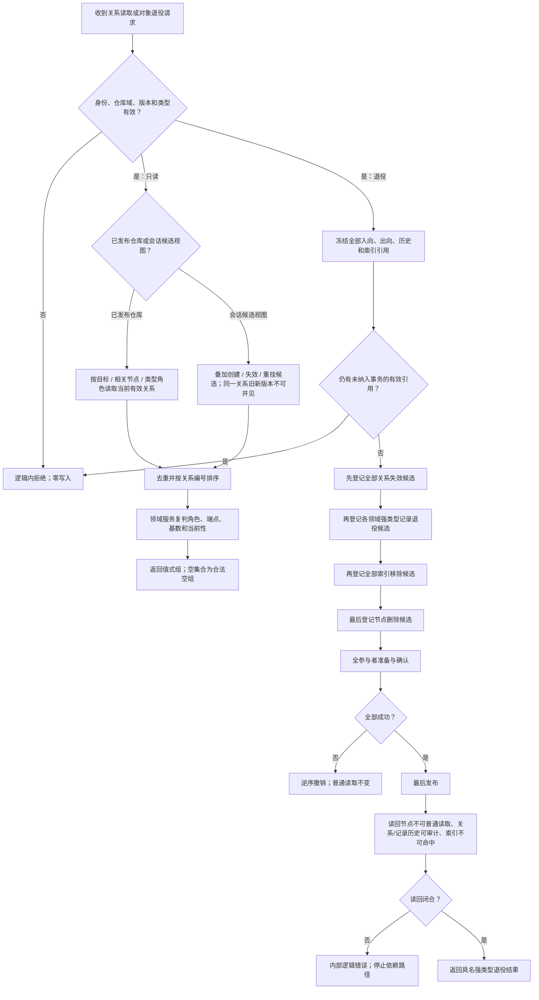

# NODE-TYPED-MIGRATION NT-P1Q 关系反向读取与退役原子能力施工流程图

更新时间：2026-07-24

## 依据

```text
规范/4010_子规范_统一仓库稳定句柄与通用关系索引边界.md
规范/4040_子规范_不透明结构事务候选确认撤销与最后发布.md
规范/详细设计/NODE-TYPED-MIGRATION_NT-P1Q_关系反向读取与退役原子能力详细设计.md
```

## 身份与边界

本图是正式施工流程图。通用仓库提供按目标、相关节点和类型角色读取，以及节点删除 / 索引移除候选；领域服务仍负责业务角色、基数、全引用冻结和领域记录退役。

## 流程图



## 关键边界

```text
消费者不得用全仓扫描补按目标 / 相关枚举；
领域退役参与者由各领域提供，不由核心仓库解释；
发布前失败整体撤销，发布后后验失败不否认已经成立的权威退役事实。
```
