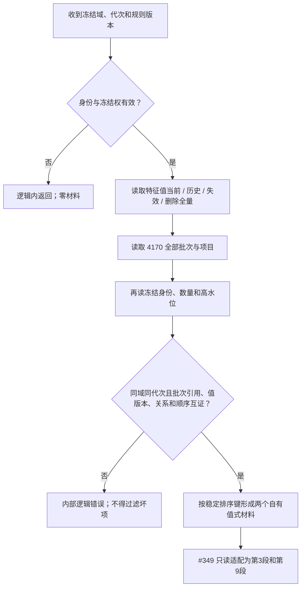

# NODE-TYPED-MIGRATION NT-P2Q 特征值与 4170 同代次冻结提供者施工流程图

更新时间：2026-07-24

## 依据

```text
规范/4070_子规范_权威结构快照恢复候选与运行期原子发布.md
规范/4170_子规范_特征批次发布记录与幂等账.md
规范/详细设计/NODE-TYPED-MIGRATION_NT-P2Q_特征值与4170同代次冻结提供者详细设计.md
```

## 身份与边界

本图是正式施工流程图；P2Q 只提供同代次值式材料，#349 只适配，不越权读取 P2A 私仓。

## 流程图



## 关键边界

```text
#375 与 #340 同文件后继，不并发写；
#349 不访问记录仓、批次账、锁、令牌或参与者；
两个材料必须同时形成，禁止部分成功。
```
