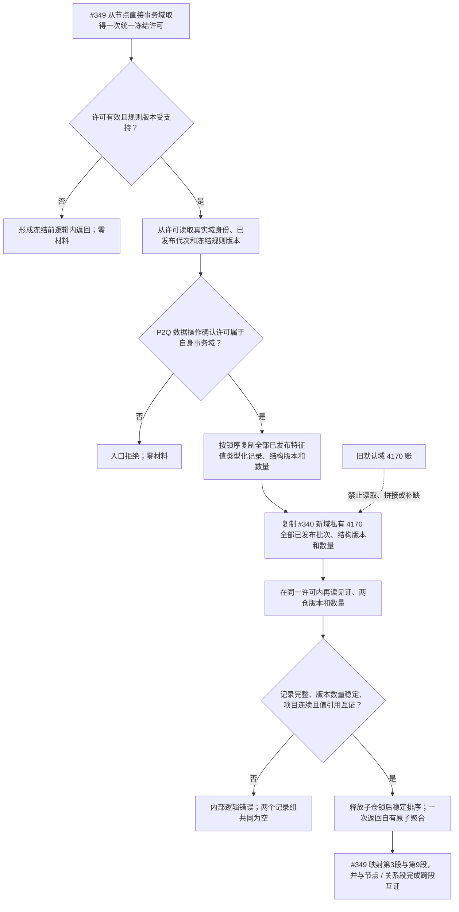

# NODE-TYPED-MIGRATION NT-P2Q 特征值与 4170 同代次冻结提供者施工流程图

更新时间：2026-07-24

## 依据

```text
规范/4070_子规范_权威结构快照恢复候选与运行期原子发布.md
规范/4170_子规范_特征批次发布记录与幂等账.md
规范/详细设计/NODE-TYPED-MIGRATION_NT-P2Q_特征值与4170同代次冻结提供者详细设计.md
执行累计父链 4018910c；#340 结果 e19ad70d
```

## 身份与边界

本图是正式施工流程图；#349 唯一取得并持有统一冻结许可，P2Q 只在该许可内复制值式材料，不取得第二冻结权。节点直接新域只读取 #340 私有 4170 账，旧默认域账不参与。

## 流程图



## 关键边界

```text
#375 与 #340 同文件后继，不并发写；
锁序固定为“统一冻结许可 -> 特征值记录仓 shared -> 新域批次仓 shared”；
公开特征服务不接触许可，#349 不访问私仓、锁、令牌或参与者；
关系端点和当前 / 历史 / 失效 / 删除分类由 #349 跨段互证；
两个记录组必须作为一个结果共同形成，禁止部分成功。
```
