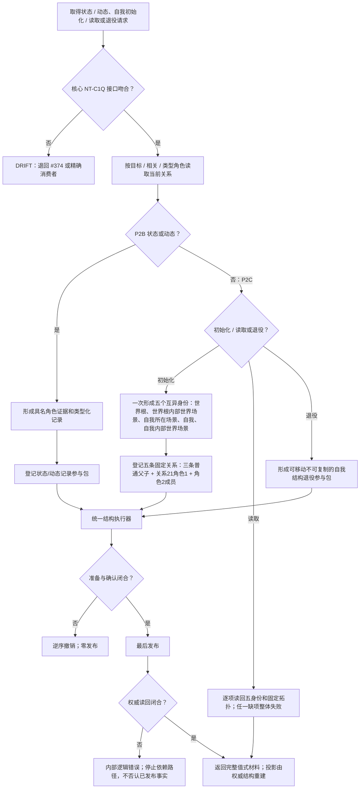

# NODE-TYPED-MIGRATION NT-P2 反向读取、五角色身份与退役参与包施工流程图

更新时间：2026-07-24

## 依据

```text
规范/4010_子规范_统一仓库稳定句柄与通用关系索引边界.md
规范/4040_子规范_不透明结构事务候选确认撤销与最后发布.md
规范/4210_子规范_动态信息分层获取与聚合_20260720.md
规范/4220_子规范_动作动态与因果账本边界_20260720.md
规范/7130_子规范_自我内部世界成员特征与事实读取投影.md
规范/详细设计/NODE-TYPED-MIGRATION_NT-P2B_状态动态完整事实类型化迁移详细设计.md
规范/详细设计/NODE-TYPED-MIGRATION_NT-P2C_自我内部世界与事实投影迁移详细设计.md
```

## 身份与边界

本图是正式施工流程图；状态 / 动态 / 自我领域只消费核心反向读取，不越权补核心仓库能力。

## 流程图



## 关键边界

```text
匿名关系组退出；五角色身份不复用；领域参与包不可复制且不暴露私仓；
P4 保存完整记录、历史和失效关系，不保存列表投影。
```
