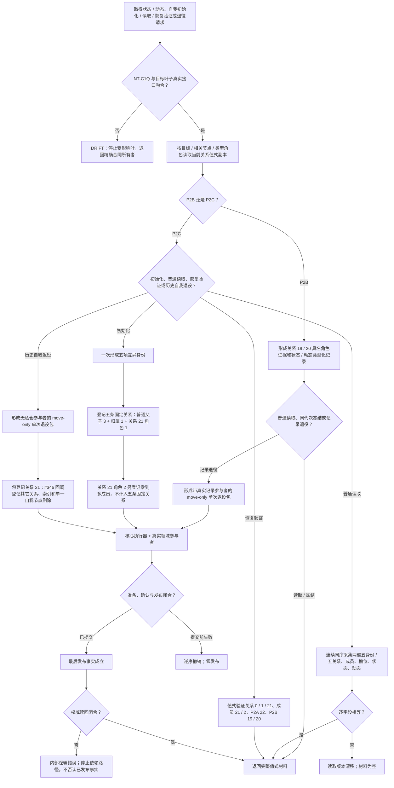

# NODE-TYPED-MIGRATION NT-P2 反向读取、五角色身份与退役参与包施工流程图

更新时间：2026-07-24

## 施工图元数据

```text
图类型：施工流程图
绑定正式规范：4010、4040、4210、4220、7130
绑定计划：NT-P2 v0.4、#341 v0.6、#342 v0.6
绑定详细设计：P2B v0.5、P2C v0.5
允许文件：分别只取 #341 / #342 叶子白名单；本图不扩大任一白名单
禁止文件：核心、相邻领域、工程、入口、运行器、默认装配及非当前计划文件
预期结构变化：P2B 形成状态 / 动态完整事实和记录参与包；P2C 形成五身份 / 五关系、恢复验证和无私仓退役包
执行前复核：NT-C1Q/v0.1、累计父链、目标叶子 blob、提供者真实接口与文件所有权
验证方式：叶子合同静态检查；完整构建 / 运行 / 接线后置
不得宣称：接口已联调、已接线、已恢复、已切换或能力完成
```

## 流程图



## 关键边界

```text
匿名关系组退出；五项身份不复用；五条固定关系不含角色 2 成员。
P2B 退役包包含真实记录参与者；P2C 没有私有记录仓，禁止伪造空参与者。
P4 保存完整记录、历史和失效关系，不保存列表投影。
```
