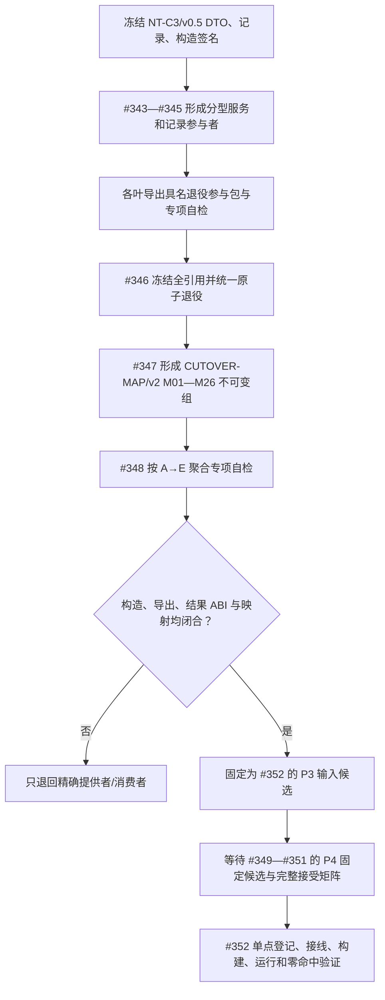

# NODE-TYPED-MIGRATION NT-P3 记录、构造、退役与自检装配闭合施工流程图

更新时间：2026-07-24

## 依据

```text
规范/详细设计/NODE-TYPED-MIGRATION_NT-P1Q_关系反向读取与退役原子能力详细设计.md
规范/详细设计/NODE-TYPED-MIGRATION_NT-P3_服务兼容删除审计迁移详细设计.md 第17—18节
NT-C1Q/v0.1、NT-C3/v0.5、CUTOVER-MAP/v2
```

## 身份与边界

本图是正式施工流程图；#343—#348 分别拥有记录、服务、退役、映射或聚合自检，#352 才拥有最终工程和运行器。

## 流程图



## 关键边界

```text
领域记录不复制拓扑；服务可移动不可复制；退役参与包不暴露私仓；
专项自检结果不是机器事实；CUTOVER-MAP 必须含完整签名与字段/结果映射。
```
