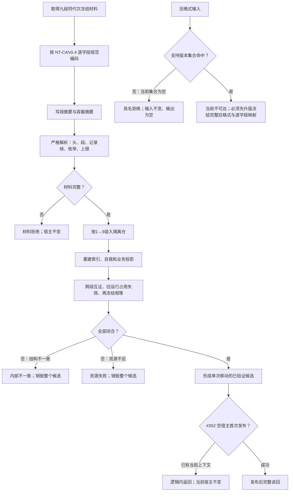

# NODE-TYPED-MIGRATION NT-P4 九段记录、严格恢复与旧格式拒绝施工流程图

更新时间：2026-07-24

## 依据

```text
规范/4070_子规范_权威结构快照恢复候选与运行期原子发布.md
规范/详细设计/NODE-TYPED-MIGRATION_NT-P4_九段记录ABI严格恢复与旧格式拒绝详细设计.md
NT-C4/v0.4
```

## 身份与边界

本图是正式施工流程图；文件是恢复材料，只有完整隔离候选通过互证并首次发布后才成为运行期事实。

## 流程图



## 关键边界

```text
九段记录 ABI 唯一由 #349 提供，#350/#351 只读消费；
未知或旧格式不得猜测补齐；恢复失败不得回退全新；发布只发生一次。
```
