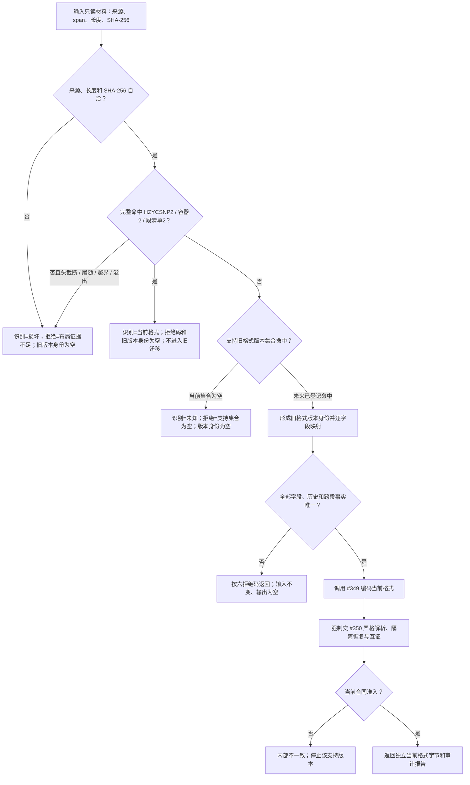

# NODE-TYPED-MIGRATION NT-P4 九段记录、严格恢复与旧格式拒绝施工流程图

更新时间：2026-07-25

## 施工图元数据

```text
图类型：施工流程图
绑定正式规范：4070、NT-C4/v0.4
绑定计划：NT-P4 v0.4、#349 v0.5、#350 v0.5、#351 v0.6
绑定详细设计：NODE-TYPED-MIGRATION NT-P4 九段记录 ABI、严格恢复与旧格式拒绝详细设计 v0.3
允许文件：分别只取 #349—#351 叶子白名单；本图不扩大白名单
禁止文件：共享工程、入口、宿主和非当前计划文件
预期结构变化：当前格式严格恢复；旧格式空支持集下完整识别 / 拒绝 DTO 与审计候选
执行前复核：HZYCSNP2 / 2 / 2、九段 ABI、NT-C4-LEGACY/v1、plan blob 和文件所有权
验证方式：叶子静态 / 源码检查；构建与运行后置 #352
不得宣称：存在可迁移旧格式、已恢复、已发布或能力完成
```



## 关键边界

1. 当前格式先于空支持集识别；损坏先于未知 / 支持集合为空。
2. 当前支持集为空，未来映射、历史、跨段和内部不一致分支不可达，不建立伪旧布局夹具。
3. 报告的人读字段不裁决迁移；机器结果只由枚举、DTO、摘要和输出可选值承担。
