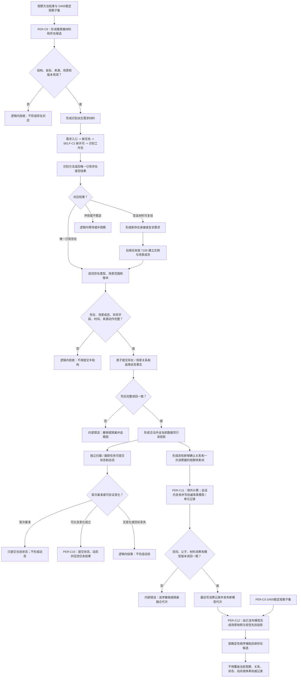

# OBSERVE-VOXEL：观察世界事实与体素融合施工流程图 v0.2

更新时间：2026-07-24

## 依据与绑定

- 正式规范：1140—1170、4010、4020、4040、4070、4210、4220、6200—6250、6300—6330、6360、6370、7100。
- 详细设计：`规范/详细设计/观察世界事实与体素融合详细设计.md` v0.2。
- 设计计划：`计划/20260724_PERCEPTION-D0_D455观察体素生产闭环设计链重建计划_v0.2.md`。
- 施工计划：#369—#372 v0.2。

本图冻结 `PER-C9—PER-C12 / ABI 2`。不建立“观察事实节点”或“体素节点类型”：观察正式结果映射到存在、场景成员关系和状态 / 动态类型化事实；权威体素模型与单元是归属于存在 / 场景的领域类型化记录，场景快照与视觉先验只是可重建投影。

## 关键边界

1. C9 不新建观察事实本体；正式身份来自存在、关系和领域事实。
2. C11 唯一写权威体素类型化记录；C12 只生成可重建投影。
3. C12 只额外消费 C5 的稳定观察子集，不消费原始帧、逐簇或泛化“观察材料”。
4. 首次扫描不形成动态；前置通过后的结构、消费或读回异常是内部错误。
