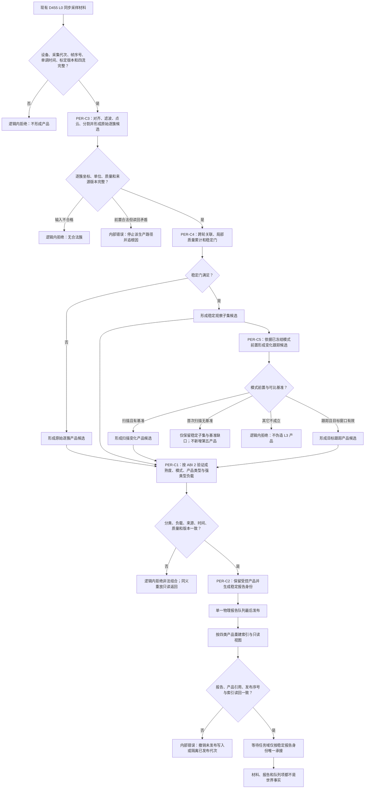

# PERCEPTION-INGEST：D455 成熟度产品受控材料报告队列施工流程图 v0.2

更新时间：2026-07-24

## 依据与绑定

- 正式规范：6300、6310、6320、6340、6350、6360。
- 详细设计：`规范/详细设计/D455成熟度产品受控材料与报告队列详细设计.md` v0.2。
- 设计计划：`计划/20260724_PERCEPTION-D0_D455观察体素生产闭环设计链重建计划_v0.2.md`。
- 施工计划：#361—#365 v0.2；共享工程、入口、运行器与真实设备装配只归 #373。

本图是待实施目标图，不是当前代码流程。它冻结 `PER-C1—PER-C5 / ABI 2`：L0 只有同步彩色、深度、左右红外、标定与采集元数据；点云从 L1 开始。三种外显模式与四种供给产品是独立分类轴。`C3 -> C4 -> C5` 只表示材料派生方向；C3、C4、C5 各自形成不同产品候选，并分别经 C1 值式验证、C2 发布，消除旧版 C1/C2 时序循环。

## 关键边界

1. C3、C4、C5 只形成候选；C1 值式验证通过后 C2 才能发布。
2. 同一报告跨窗口、任务和恢复代次只使用 `D455报告身份` 作为唯一消费键。
3. 原始逐簇不得进入业务方法；首次无基准只形成合法基准缺口。
4. 前置拒绝是逻辑内返回；前置通过后的确认、读回或发布不一致是内部错误。
