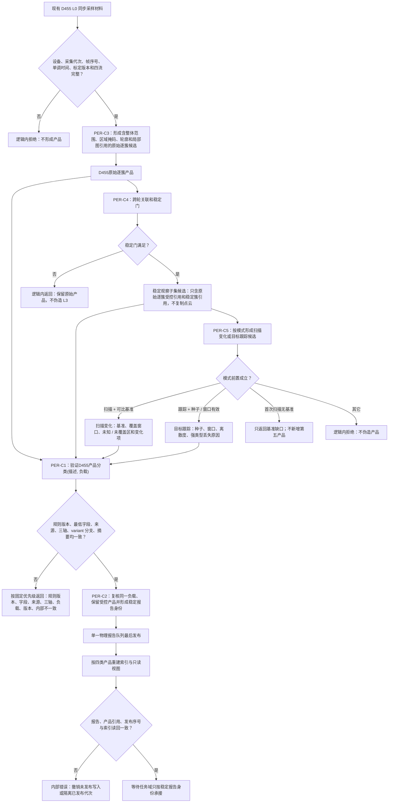

# PERCEPTION-INGEST：D455 成熟度产品受控材料报告队列施工流程图 v0.3

更新时间：2026-07-25

## 施工图元数据

```text
图类型：施工流程图
绑定正式规范：6300、6310、6320、6340、6350、6360
绑定计划：计划/20260724_PERCEPTION-D0_D455观察体素生产闭环设计链重建计划_v0.2.md；#361 v0.3；#362—#365 v0.2
绑定详细设计：规范/详细设计/D455成熟度产品受控材料与报告队列详细设计.md v0.3
允许文件：分别只取 #361—#365 各叶子白名单；本图不扩大任一白名单
禁止文件：共享工程、入口、运行器和生产装配，统一归 #373
预期结构变化：C1 统一四负载 DTO / variant 与联合验证；C3—C5 只形成强类型候选；C2 保留和发布
执行前复核：现有 L0 接口、PER-C1 完整字段 / ABI、各叶子 plan blob 和文件所有权
验证方式：叶子静态合同检查；构建、运行、接线和真实硬件验收后置 #373
不得宣称：产品已实现、已编译、已发布、已接线或真实 D455 能力完成
```

本图是待实施目标图，不是当前代码流程。L0 只有同步彩色、深度、左右红外、标定与采集元数据；点云从 L1 开始。C1 统一拥有四负载 DTO 和 `D455产品负载`，C3—C5 只拥有形成算法。



## 关键边界

1. C1 不 import C2—C5；C2—C5 只 import C1 的公开值类型。
2. 字段缺失先于三轴非法和负载错配，复合错误不随遍历顺序变化。
3. 稳定子集不得复制原始逐簇点云、掩码或局部图。
4. 报告、候选、队列项和索引都不是世界事实。
