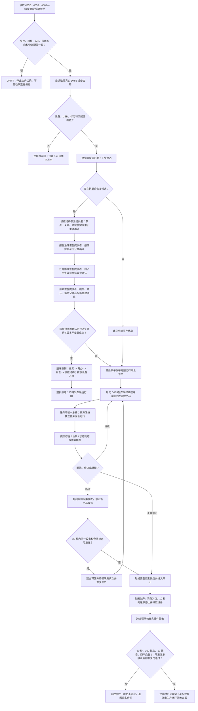

# PERCEPTION-RUNTIME：真实 D455 生产装配恢复验收施工流程图 v0.2

更新时间：2026-07-24

## 依据与绑定

- 正式规范：1140—1170、3200、3300、4010、4020、4040、4070、6200—6370、8100、8110。
- 详细设计：`规范/详细设计/真实D455生产装配恢复与验收详细设计.md` v0.2。
- 设计计划：`计划/20260724_PERCEPTION-D0_D455观察体素生产闭环设计链重建计划_v0.2.md`。
- 施工计划：#373 v0.2，唯一拥有工程、入口、生产宿主、线程、停止 / 恢复和真实硬件验收。

本图冻结 `PER-C13 / ABI 2`。#373 只读消费 #352、#359、#361—#372 的固定结果提交；任何候选缺失或 ABI 漂移都返回具名 DRIFT。恢复由权威结构、报告治理、任务筹办和体素四个提供者独立确认，失败时逆序撤销，完整运行期上下文最后一次发布。

## 关键边界

1. 四类恢复提供者各自裁决本域；C13 只编排确认、逆序撤销和最后发布。
2. 物理队列、索引、日志、控制面板和显示网格都不是恢复权威。
3. #373 不修改 #361—#372 私有实现；接口漂移只退回对应合同。
4. 构建或模拟自检不能替代真实 D455 连续采集、断流、停止和跨进程验收。
