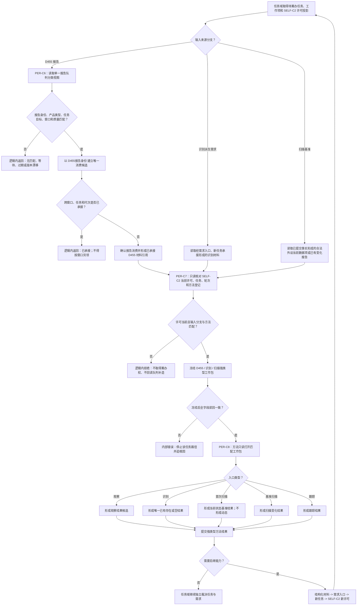

# PERIPHERAL-TASK：任务唯一消费冻结工作包观察方法施工流程图 v0.2

更新时间：2026-07-24

## 依据与绑定

- 正式规范：3200、3300、5230、5300、6320、6340—6370。
- 详细设计：`规范/详细设计/D455任务唯一消费冻结工作包与观察方法详细设计.md` v0.2。
- 设计计划：`计划/20260724_PERCEPTION-D0_D455观察体素生产闭环设计链重建计划_v0.2.md`。
- 施工计划：#366—#368 v0.2。

本图冻结 `PER-C6—PER-C8 / ABI 2`。C6 以稳定报告身份裁决全局唯一承接；C7 只读取 SELF-C2 已发布的筹办许可投影，不创建、迁移、恢复或取得筹办占用；四方法仅消费匹配的不可变工作包，彼此零直接调用。

## 关键边界

1. C6 的唯一键是报告身份；窗口、任务和工作项只作准入和绑定。
2. C7 只读许可并冻结工作包，SELF-C2 仍是筹办占用唯一所有者。
3. 识别不直通 D455；首次扫描材料只能来自已提交权威结构的完整读回投影。
4. 方法结果通过新需求、新任务和新筹办回合衔接，四方法不得互调。
