# SAFETY-PRIORITY：安全值维护与因果优先级施工流程图 v0.1

更新时间：2026-07-24

## 依据

- `规范/0050_项目通用机器逻辑与禁止性规则总纲_20260721.md`
- `规范/3100_根规范_需求_20260720.md`
- `规范/3200_根规范_任务_20260720.md`
- `规范/1160_根规范_状态节点_20260720.md`
- `规范/1170_根规范_动态节点_20260720.md`
- `规范/6100_子规范_安全服务值结算_20260720.md`
- `规范/6110_子规范_生存深层需求投影_20260720.md`
- `规范/6120_子规范_自我存在服务与生存基本因果闭环_20260720.md`
- `规范/4320_子规范_状态转换因果与目标投影层级_20260720.md`
- `规范/6140_子规范_分层安全值被动变化与残余风险维护.md`
- `规范/6150_子规范_因果安全层级与任务执行优先级权限.md`
- `规范/8100_子规范_自我线程与任务管理线程权责边界_20260720.md`
- `规范/8200_子规范_自我内部循环实现_20260720.md`
- `规范/详细设计/分层安全值被动变化与因果任务执行优先级详细设计.md`

## 施工元数据

| 项 | 冻结内容 |
| --- | --- |
| 图类型 | 待实施目标流程图；不是当前代码流程 |
| 设计身份 | `SAFETY-PRIORITY / v0.1` |
| 绑定详细设计 | `规范/详细设计/分层安全值被动变化与因果任务执行优先级详细设计.md` |
| 数值合同 | 各层安全值、值域、阈值、速率和时间单位使用 I64；6120 生存安全根轴独立使用 `0..I64_MAX`；权限比例使用分母 `1,000,000` 的 I64 定点数 |
| 时间合同 | 使用单调纳秒；只有复发机会、感知覆盖、场景与因素身份可比且未复发时才累计有效未复发时间 |
| 因果合同 | 到具体安全结果的直接因果链取最短精确 I64 深度；仅 `D>=1` 时调度组为 `min(D, 5)`，`D=0` 不成组 |
| 原子边界 | 安全领域事务原子发布安全值、状态 / 动态、证据水位和维护账；权限随后从同一一致性快照计算，由任务调度冻结消费 |
| 调度边界 | 自我线程每轮只调用一次；任务调度只消费权限投影，不反向改写安全值 |
| 不得宣称 | 流程图或候选实现不证明生产接线、完整构建、长期行为或真实风险验收完成 |

## 身份与边界

安全事件、因素、排除事实、场景、感知覆盖和单调时间是维护材料；安全值、状态 / 动态和权限投影由正式领域入口裁决。线程只调度，任务调度只消费投影，服务值不进入本算法。

```mermaid
flowchart TD
    A["自我线程每个治理循环调用一次安全维护评估；只传当前单调时间与轮次材料引用"] --> B["安全领域服务读取同一版本快照：自我、分层安全需求、各层安全值与阈值、历史事件与因素、排除事实、当前场景、感知覆盖、因果、需求和任务"]
    B --> C{"身份、类型、版本、Vmin 小于等于 V 小于等于 Vmax 及 Vmin 小于等于 L 小于 H 小于等于 Vmax 是否成立？"}
    C -- "材料不足或版本已漂移" --> R1["逻辑内拒绝：不发布安全值半结构，也不形成可用权限投影"]
    C -- "前置成立" --> D["按发生时间、事实类型优先序和稳定身份冻结本轮新增材料；同刻先处理新安全事件"]

    D --> E{"本轮是否有新安全事件、复发、因素变化或其它主动安全结算材料？"}
    E -- "是" --> F["读取 6100 或合法领域已发布的主动安全结算后值；SAFETY-C1 不代写事件或主动结算，并重置相关维护纪元"]
    E -- "否" --> G["保持主动安全事实结算后的当前值"]
    F --> H
    G --> H{"具名历史事件的因素是否出现验证性排除？"}
    H -- "部分排除" --> I["只标记具名已排除因素；未知因素保持未知，残余风险约束继续"]
    H -- "全部具名因素排除" --> J["解除该事件残余风险约束；由合法主动结算入口按当前事实发布新结论，SAFETY-C1 只读消费"]
    H -- "无新排除" --> K["保持当前因素集合和残余风险约束"]
    I --> L
    J --> L
    K --> L{"本层本批是否发生新事件、复发或主动安全值结算？"}
    L -- "是" --> M["重置受影响维护纪元；本层本批跳过被动回归，保持主动结算结果"]
    L -- "否" --> N["进入有效未复发证据评估"]

    N --> O{"相关因素在当前场景是否有复发机会，且感知覆盖有效、场景与因素身份可比并确认未复发？"}
    O -- "否" --> P["有效未复发增量为 0；物理时间本身不产生安全事实"]
    O -- "是" --> Q["按单调实际经过纳秒累计有效未复发时间；扣除新事件或主动变化覆盖的区间"]
    P --> S
    Q --> S{"按主动结算后的当前安全值 V 与阈值 L、H 分段"}
    S -- "V 小于 L" --> T["线性低位回升：按本层版本化 Rup、Utime、累计余数和有效时间增加，封顶 L"]
    S -- "L 小于等于 V 且 V 小于等于 H" --> U["逻辑内返回：本段不发生被动回归；新事实结果保持有效"]
    S -- "V 大于 H 且仍有未排除因素" --> V["线性高位回落：按本层版本化 Rdown、Utime、累计余数和有效时间减少，封底 H"]
    S -- "V 大于 H 且残余约束已解除" --> W["不执行高位回落；保持主动重结算结果"]

    T --> X["按 Q(T)=floor(R×T/Utime) 用 I64、128 位中间量、向下取整和累计时间余数形成安全值候选"]
    U --> X
    V --> X
    W --> X
    M --> AM
    X --> AM["逐参与者准备安全值状态、维护动态、事件因素水位、有效时间余数和维护账；准备阶段完成候选写入与首次写后读回"]
    AM --> AN{"全部准备、写后读回和版本复核是否成立？"}
    AN -- "否" --> E1["内部错误：撤销全部候选，停止受影响路径并追根因"]
    AN -- "是" --> AN0["按依赖顺序确认全部参与者"]
    AN0 -- "确认失败" --> E1
    AN0 -- "全部确认" --> AO["最后原子发布安全维护事实；不存在可读半结构"]
    AO --> Y["权限服务从当前一致性快照读取需求、安全值、阈值和直接因果图"]
    Y --> Y0{"因果图、端点和来源版本是否完整一致？"}
    Y0 -- "否" --> R3["权限投影拒绝或失效：保留已经发布的安全事实，不形成调度候选"]
    Y0 -- "是" --> Y1["取到具体安全结果的最短直接因果路径精确 I64 深度 d；仅 d>=1 时形成组 min(d, 5)，d=0 不成组"]
    Y1 --> AA["D=0 不形成调度组；为组 1—4 内每个当前有效安全层计算向上释放倍率 R(V)，同组多个层取最小倍率并保留限制层来源"]
    AA --> AB{"单层安全值区间"}
    AB -- "V 小于等于 L" --> AC["R(V)=0；本组阻断向上释放"]
    AB -- "L 小于 V 且 V 小于 H" --> AD["R(V)=floor((V-L)×990,000/(H-L))"]
    AB -- "V 大于等于 H" --> AE["R(V)=990,000；本层仍保留收到权限的 1%"]
    AC --> AF
    AD --> AF
    AE --> AF["令 A1=1,000,000；对 g=1..4 计算 A(g+1)=floor(Ag×Rg/1,000,000)，Qg=Ag-A(g+1)"]
    AF --> AG["令 Q5=A5；向下取整余量留在较低组，保证 Q1+Q2+Q3+Q4+Q5=1,000,000"]

    AG --> AH["任务关联多个需求时取最高执行权限作为任务权限，同时保留全部层级、需求和因果来源"]
    AH --> AI["任务有效排序值 = 基础优先级乘任务权限除以 1,000,000；权限为 0 的任务不参加正常执行竞争"]
    AI --> AJ["组 1—4 按有效排序值、权限、基础优先级和稳定键比较；组 5 依次比较权限、后果严重度、安全不足度、时间证据、因果证据、基础优先级、真实深度、规范化最短路径键、来源需求稳定句柄、任务创建序号、任务稳定句柄"]
    AJ --> AK{"是否存在可执行任务？"}
    AK -- "否" --> R2["逻辑内返回：任务仍存在、可筹办和接收材料；观察与事实登记继续"]
    AK -- "是" --> AL["形成值式任务执行优先级权限投影和排序候选"]
    R2 --> AQ
    R3 --> AQ
    AL --> AP["任务调度在派发前重读并冻结任务与权限来源；漂移时移除候选并重算，不得反向改写安全值"]
    AP --> AQ["自我线程接收值式结果并进入下一治理循环；线程不是动作来源"]
```

## 关键边界

1. 安全值是每层安全需求的当前安全 / 满足程度；每层分别冻结 I64 的 `Vmin、Vmax、L、H、Rup、Rdown、Utime` 和规则版本，并满足 `Vmin <= V <= Vmax`、`Vmin <= L < H <= Vmax`。6120 的 `0..I64_MAX` 生存安全根轴是独立控制事实，不进入本流程的分层维护。
2. 低位回升和高位回落均为线性被动曲线。公式固定为 `Q(T)=floor(R×T/Utime)`，本轮变化量取累计值之差；使用至少 128 位中间量、向下取整和累计时间余数。重复传入相同时间水位时变化量为零。
3. 新安全事件、复发、因素变化和排除由各自合法领域发布，主动安全结算由 6100 合法入口发布；SAFETY-C1 只读消费主动结算后值，随后重算残余约束并裁决被动维护。同一批按发生时间、类型优先序和稳定身份确定性处理；被新事件或主动变化覆盖的时间区间不得再次用于被动回归。
4. 有效未复发时间必须同时满足复发机会、感知覆盖、场景与因素身份可比、确认未复发四项条件；物理时间和循环次数不能独立提高安全值。
5. 多事件先按事件稳定身份维护各自因素集合和有效时间，再按具体安全结果聚合；任一未知或未排除因素仍保留残余风险。不得把最低安全度、日志或显示当成聚合事实。
6. 到具体安全结果的直接因果链取最短精确 I64 深度；仅 `D>=1` 时调度组为 `min(D, 5)`，`D=0` 不成组；不存在有效直接链时不得伪造深度或进入正常安全任务排序。
7. 权限递归以组 1 收到的 `1,000,000` 为唯一发行量；组 1—4 各自以同组安全层最小释放倍率门控到更高组，组 5 取得最终余量。`D=0` 不形成第 0 组；向下取整余量留在较低组，五组权限恒等于 `1,000,000`，空组权限保持未消费，不重分配。
8. 任务关联多个需求时只用最高权限参与排序，但必须保留全部权限来源，供审计、风险变化和后续重算使用。权限为零不删除、取消、改写任务或停止观察。
9. 基础优先级与权限的合成只影响正常任务执行竞争，不表示线程、时间、算力或任务数量配额，也不保证 99% 的执行时间。
10. 第 5 组依次比较权限、正式后果严重程度、归一化安全不足度、预计发生时间或时间证据、因果基础证据、任务基础优先级、真实精确深度和稳定顺序键；本应适用却缺失的材料形成具名缺口，不能使用默认值。
11. 自我线程只负责每轮调用；安全领域服务负责安全事实裁决和原子发布；权限服务形成值式投影，任务调度只冻结消费。调度拥塞不得反向改变安全值。
12. 材料不足、无变化、权限为零和无可执行任务属于不产生半结构的逻辑内返回；安全事实事务在前置通过后发生状态 / 动态、关系、读回或发布失败时必须撤销并追根因。安全事实已经合法发布后，权限来源漂移只使本轮投影失效并重算，不得回滚安全事实；合法前置下权限纯值算法违反守恒或确定性才属于内部错误。
13. 本流程只覆盖安全值和安全任务权限；不得把同一被动回归或层级门控算法直接套用到服务值。
