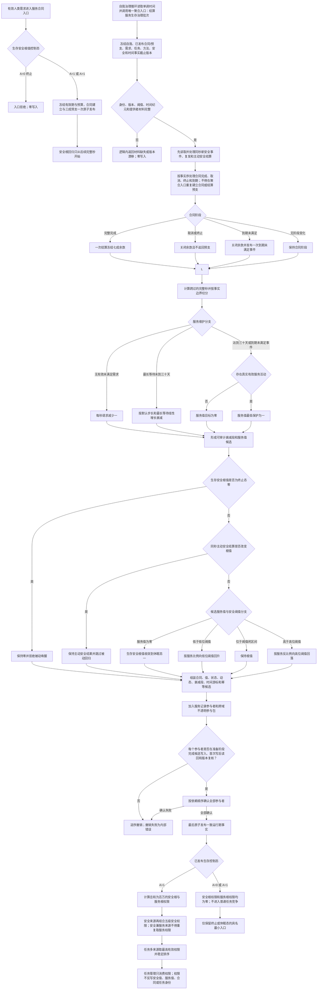

# 服务合同、服务值维护与生存安全回归施工流程图

更新时间：2026-07-24

## 依据

```text
规范/0050_项目通用机器逻辑与禁止性规则总纲_20260721.md
规范/3100_根规范_需求_20260720.md
规范/3200_根规范_任务_20260720.md
规范/3300_根规范_方法_20260720.md
规范/4040_子规范_不透明结构事务候选确认撤销与最后发布.md
规范/6100_子规范_安全服务值结算_20260720.md
规范/6120_子规范_自我存在服务与生存基本因果闭环_20260720.md
规范/6140_子规范_分层安全值被动变化与残余风险维护.md
规范/6150_子规范_因果安全层级与任务执行优先级权限.md
规范/6160_子规范_服务需求合同预算与准备结算.md
规范/6170_子规范_服务值时间维护生存安全回归与任务门控.md
规范/8100_子规范_自我线程与任务管理线程权责边界_20260720.md
规范/8200_子规范_自我内部循环实现_20260720.md
```

## 身份与边界

这是正式施工流程图。它定义 `SERVICE-C1—C3 / v1` 的目标调用顺序：服务领域负责合同、服务值与生存安全根值候选及原子发布；线程只调度，任务管理只消费已发布权限投影。它不表示代码、工程接线或生产能力已经存在。

## 流程图



## 关键边界

```text
1. 全部机器数值使用 I64；比例权限固定百万倍率，乘法使用宽中间值或等价检查算法。
2. 时间只读单调完整秒；批量结果必须与按事实序逐秒参考结果相同，并形成可审计聚合衰减段。
3. 默认有效期是项目版本化默认 2,592,000 秒，不冒充提出者明确表达。
4. 到期先形成合同终态；到期前仍未满足时另发一次同秒到期未满足事件，使三十天门禁可达但不恢复合同，也不建立压力概念。
5. 有效活动最低一只保护已经为正的服务值，不凭活动标签从零生成服务值。
6. 生存安全根值零是终止态，在全部普通回归分支前保持；同秒真实安全事件优先。
7. 服务值只调节生存安全根回归，不改写 6140 分层安全值；调度不得反向改值。
8. 新合同与三成预支由合同入口独立原子发布；生产循环只调用聚合入口处理余款 / 关闭、准备补回、完整秒与安全根回归，二者不得重复结算预支。
9. 每个参与者必须在准备阶段完成候选写入与首次写后读回；全部通过后才确认并最后发布，不得在确认后首次读回。
10. `A=0/1` 时普通安全 / 服务任务权限均为零；只有 `A>1` 才进入根权限与普通任务排序。
11. #379 只形成隔离提供者源码候选；线程、任务管理、真实适配、工程、恢复和生产验收归 #359。
```
