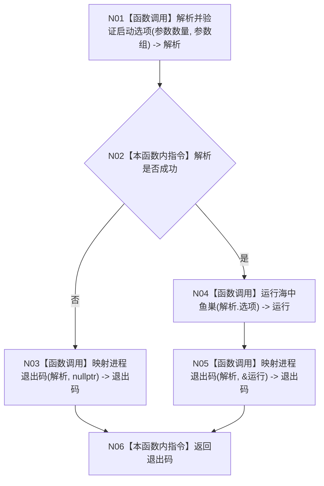

# ENTRY-ONLY F01 `main` 施工流程图

更新时间：2026-07-26

## 依据

```text
规范/8120_子规范_程序入口启动模式与运行宿主边界_20260726.md
规范/详细设计/20260726_ENTRY-ONLY_入口职责单一化详细设计_v0.1.md
计划/20260726_ENTRY-ONLY_薄入口模式路由与初始化宿主分层代码实施计划_v0.1.md
```

## 身份与边界

正式施工流程图；只在本计划允许文件内实施。

## 函数合同

以下冻结元数据中的根函数、归属、参数、返回、允许/禁止范围和执行前复核共同构成本图函数合同。

图类型：施工流程图
版本：v0.1
根函数：`int main(int 参数数量, char* 参数组[])`
归属：`海中鱼巣/入口.cpp`
参数：进程参数，只读且不保存；返回：进程退出码 0/1/2。
绑定：规范 8120；ENTRY-ONLY 详细设计；ENTRY-ONLY 计划。
允许文件：`海中鱼巣/入口.cpp`；禁止：在本函数构造领域、UI、SQL、自检或日志对象。
预期结构变化：无机器结构变化。执行前复核 F02/F03/F04 签名；验证 V01-V06、V29。不得宣称领域能力完成。

## 流程图



## 节点合同

| 节点 | 类型 | 输入/输出 | 逐节点实现分析 |
| --- | --- | --- | --- |
| N01 | 被调函数 | argv -> T01 | 唯一参数入口，不解释具体 flag。 |
| N02 | 指令 | T01 | 只读 `成功()`。 |
| N03/N05 | 被调函数 | T01/T02 -> int | 退出码由具名函数统一映射。 |
| N04 | 被调函数 | 启动选项 -> T02 | 唯一顶层程序调用。 |
| N06 | 指令 | int | 返回，不输出。 |

被调图：F02、F03、F04。调用方：操作系统进程入口。

## 关键边界

图前冻结的允许/禁止范围、结构变化、验证和不得宣称条款均为本图关键边界。
