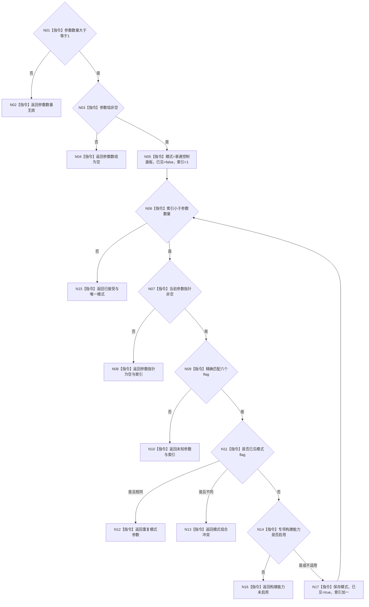

# ENTRY-ONLY F02 解析并验证启动选项

图类型：施工流程图
完整签名：`启动选项解析结果 解析并验证启动选项(int 参数数量, char* const 参数组[]) noexcept`
归属：`海中鱼巣/启动.程序入口.ixx`；参数只读；返回 T01。
绑定：规范 8120、详细设计第 3 节、计划；允许新入口模块，禁止装配、日志和结构写入。
预期结构变化：无。执行前复核六个 flag 与两个能力宏；验证 V04-V06、V24-V25。不得宣称模式已执行。

| 节点 | 类型 | 输入/输出 | 逐节点实现分析 |
| --- | --- | --- | --- |
| N01-N04 | 指令 | argc/argv -> 拒绝 | 空入口材料逻辑内返回。 |
| N05-N10 | 指令 | 参数字符串 | 顺序扫描，未知不忽略。 |
| N11-N13 | 指令 | 已见模式 | 同 flag 与异 flag 分开拒绝。 |
| N14/N16 | 指令 | 编译宏 | 只裁决能力，不执行专项。 |
| N15/N17 | 指令 | 唯一模式 | 完成或继续循环。 |

被调函数：仅标准库 `string_view` 外部边界；无项目被调图。调用方：F01。
