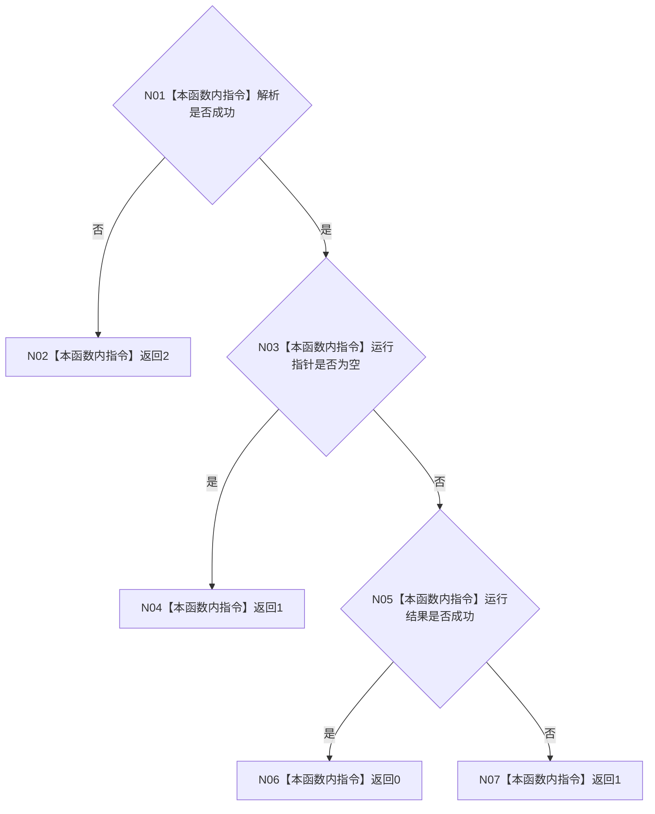

# ENTRY-ONLY F03 映射进程退出码

更新时间：2026-07-26

## 依据

```text
规范/8120_子规范_程序入口启动模式与运行宿主边界_20260726.md
规范/详细设计/20260726_ENTRY-ONLY_入口职责单一化详细设计_v0.1.md
计划/20260726_ENTRY-ONLY_薄入口模式路由与初始化宿主分层代码实施计划_v0.1.md
```

## 身份与边界

正式施工流程图；只在本计划允许文件内实施。

## 函数合同

以下冻结元数据中的根函数、归属、参数、返回、允许/禁止范围和执行前复核共同构成本图函数合同。

图类型：施工流程图
完整签名：`int 映射进程退出码(const 启动选项解析结果& 解析, const 程序运行结果* 运行) noexcept`
归属：`海中鱼巣/启动.程序入口.ixx`；返回 0/1/2。绑定规范 8120、详细设计第 3.2 节和计划。
允许：只读 DTO；禁止日志、模式重判和结构访问。结构变化：无。复核 T01/T02；验证 V04-V07、V15-V25。不得宣称日志等于成功。

## 流程图



## 节点合同

| 节点 | 类型 | 说明 |
| --- | --- | --- |
| N01-N07 | 指令 | 纯值映射；不调用函数、不读取日志。 |

调用方：F01；被调函数：无。

## 关键边界

图前冻结的允许/禁止范围、结构变化、验证和不得宣称条款均为本图关键边界。
