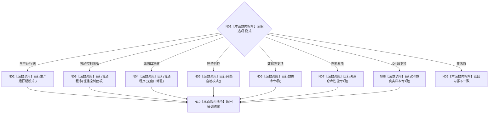

# ENTRY-ONLY F04 运行海中鱼巣

更新时间：2026-07-26

## 依据

```text
规范/8120_子规范_程序入口启动模式与运行宿主边界_20260726.md
规范/详细设计/20260726_ENTRY-ONLY_入口职责单一化详细设计_v0.1.md
计划/20260726_ENTRY-ONLY_薄入口模式路由与初始化宿主分层代码实施计划_v0.1.md
```

## 身份与边界

正式施工流程图；只在本计划允许文件内实施。

## 函数合同

以下冻结元数据中的根函数、归属、参数、返回、允许/禁止范围和执行前复核共同构成本图函数合同。

图类型：施工流程图
完整签名：`程序运行结果 运行海中鱼巣(const 启动选项& 选项)`
归属：`海中鱼巣/启动.应用程序.ixx`；返回 T02。绑定规范 8120、详细设计第 5 节、计划。
允许：顶层路由；禁止自行装配或执行模式正文。结构变化：由被调模式函数决定。执行前复核枚举七值；验证 V02-V07、V15、V20、V24-V25。不得宣称所有模式成功。

## 流程图



## 节点合同

| 节点 | 类型 | 绑定 |
| --- | --- | --- |
| N01/N09/N10 | 指令 | 完整 switch，不设 default 成功。 |
| N02-N08 | 被调函数 | 分别绑定 F05/F06/F15/F11/F16/F17。 |

调用方 F01；被调图 F05、F06、F11、F15、F16、F17。

## 关键边界

图前冻结的允许/禁止范围、结构变化、验证和不得宣称条款均为本图关键边界。
