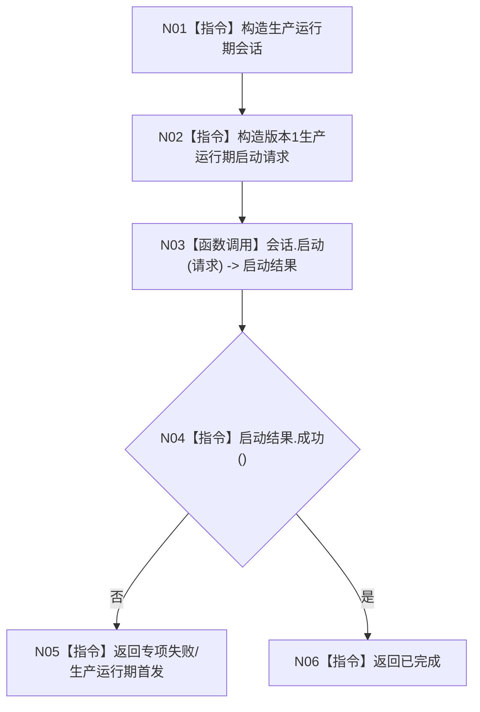

# ENTRY-ONLY F05 运行生产运行期模式

图类型：施工流程图
完整签名：`程序运行结果 运行生产运行期模式()`
归属：`海中鱼巣/启动.应用程序.ixx`；无参数；返回 T02。绑定规范 8120 第 8 节、详细设计 12.1、计划。
允许：构造会话和版本请求；禁止普通装配、自检、UI、SQL。结构变化：C01 可首次发布生产上下文。复核 C01 精确签名；验证 V07、V23。不得宣称后继治理已接通。

| 节点 | 类型 | 输入/输出 | 实现分析 |
| --- | --- | --- | --- |
| N01/N02 | 指令 | 固定版本请求 | 会话覆盖函数生命周期。 |
| N03 | 被调函数 | 请求 -> C01 结果 | 不把结果直接当退出码。 |
| N04-N06 | 指令 | C01 -> T02 | 租约有效由 `成功()` 裁决。 |

调用方 F04；被调合同 C01。
