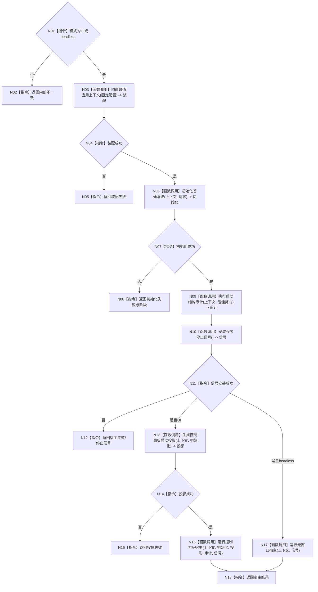

# ENTRY-ONLY F06 运行普通程序

图类型：施工流程图
完整签名：`程序运行结果 运行普通程序(启动模式 模式)`
归属：`海中鱼巣/启动.应用程序.ixx`；返回 T02。绑定规范 8120、详细设计第 8 节、计划。
允许：编排 F07-F10、F12-F14；禁止自检正文和专项。结构变化：生产必要初始化、可选审计投影。执行前复核 T03-T07；验证 V02-V03、V08-V14、V17-V19、V23。不得把审计成功当初始化成功。

| 节点 | 类型 | 实现分析 |
| --- | --- | --- |
| N01/N02 | 指令 | 拒绝其它模式，不回退。 |
| N03/N06 | 被调函数 | T03/T04 唯一创建。 |
| N09 | 被调函数 | 结果保留但不门禁普通运行。 |
| N10 | 被调函数 | UI/headless 共用结构化信号租约。 |
| N13 | 被调函数 | 只在 UI 求值。 |
| N16/N17 | 被调函数 | 两宿主互斥。 |
| 其余 | 指令 | 映射结构化失败或返回。 |

调用方 F04；被调图 F07-F10、F12-F14。
