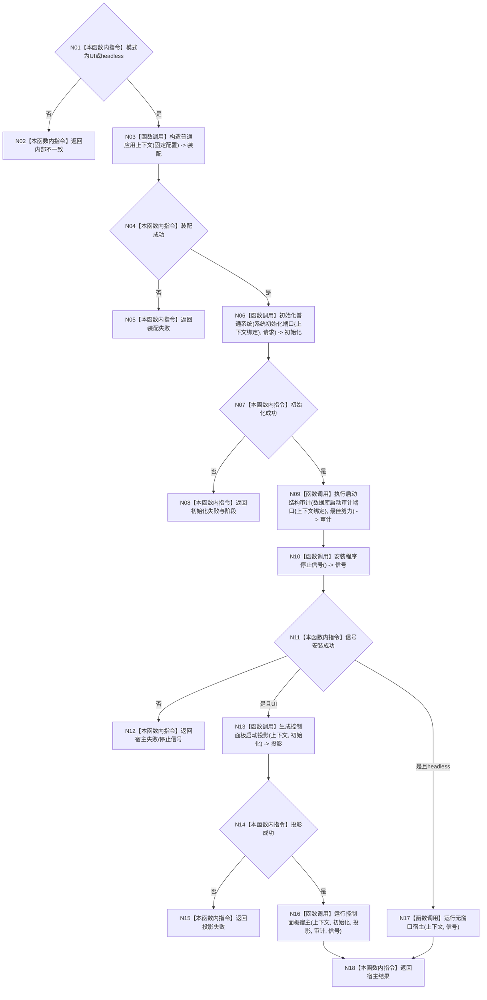

# ENTRY-ONLY F06 运行普通程序

更新时间：2026-07-26

## 依据

```text
规范/8120_子规范_程序入口启动模式与运行宿主边界_20260726.md
规范/详细设计/20260726_ENTRY-ONLY_入口职责单一化详细设计_v0.1.md
计划/20260726_ENTRY-ONLY_薄入口模式路由与初始化宿主分层代码实施计划_v0.1.md
```

## 身份与边界

正式施工流程图；只在本计划允许文件内实施。

## 函数合同

以下冻结元数据中的根函数、归属、参数、返回、允许/禁止范围和执行前复核共同构成本图函数合同。

图类型：施工流程图
完整签名：`程序运行结果 运行普通程序(启动模式 模式)`
归属：`海中鱼巣/启动.应用程序.ixx`；返回 T02。绑定规范 8120、详细设计第 8 节、计划。
允许：编排 F07-F10、F12-F14；禁止自检正文和专项。结构变化：生产必要初始化、可选审计投影。执行前复核 T03-T07；验证 V02-V03、V08-V14、V17-V19、V23。不得把审计成功当初始化成功。

## 流程图



## 节点合同

| 节点 | 类型 | 实现分析 |
| --- | --- | --- |
| N01 | 本函数内指令 | 仅接受普通控制面板或无窗口常驻；其它值进入 N02。 |
| N02 | 本函数内指令 | 返回 `程序运行状态::内部不一致`，零装配。 |
| N03 | 函数调用 | 固定普通应用配置调用 F07，绑定 `普通应用装配结果 装配`。 |
| N04/N05 | 本函数内指令 | 以 `装配.成功()` 分支；失败映射 `装配失败`。 |
| N06 | 函数调用 | 从 `*装配.上下文` 绑定完整 T08，与请求调用 F08，绑定 `系统初始化结果 初始化`。 |
| N07/N08 | 本函数内指令 | 以 `初始化.成功()` 分支；失败保留其精确阶段。 |
| N09 | 函数调用 | 从上下文绑定完整 T09，以 `最佳努力` 调用 F10；结果保留但不门禁普通运行。 |
| N10 | 函数调用 | 默认 `&std::signal` 调用 F12，绑定独占停止信号租约。 |
| N11/N12 | 本函数内指令 | 信号失败映射 `宿主失败/停止信号`，不进入任何宿主。 |
| N13 | 函数调用 | 仅 UI 分支以上下文和初始化调用 F09，绑定投影。 |
| N14/N15 | 本函数内指令 | 投影失败映射 `投影失败`，不构造窗口。 |
| N16 | 函数调用 | UI 分支绑定上下文、初始化、投影、审计、信号调用 F13。 |
| N17 | 函数调用 | headless 分支仅绑定上下文和信号调用 F14。 |
| N18 | 本函数内指令 | 原样返回互斥宿主之一的 T02；所有借用对象仍存活。 |

调用方 F04；被调图 F07-F10、F12-F14。

## 关键边界

图前冻结的允许/禁止范围、结构变化、验证和不得宣称条款均为本图关键边界。
