# ENTRY-ONLY F07 构造普通应用上下文

更新时间：2026-07-26

## 依据

```text
规范/8120_子规范_程序入口启动模式与运行宿主边界_20260726.md
规范/详细设计/20260726_ENTRY-ONLY_入口职责单一化详细设计_v0.1.md
计划/20260726_ENTRY-ONLY_薄入口模式路由与初始化宿主分层代码实施计划_v0.1.md
```

## 身份与边界

正式施工流程图；只在本计划允许文件内实施。

## 函数合同

以下冻结元数据中的根函数、归属、参数、返回、允许/禁止范围和执行前复核共同构成本图函数合同。

图类型：施工流程图
完整签名：`普通应用装配结果 构造普通应用上下文(const 普通应用配置& 配置)`
归属：`海中鱼巣/装配.普通应用.ixx`；返回独占 T03。绑定规范 8120、详细设计第 6 节、计划。
允许：按固定顺序构造 26 成员；禁止初始化业务结构、写入事务和自检。预期结构变化：只构造空仓库/服务对象。执行前复核全部构造签名；验证 V08。不得宣称系统已初始化。

## 流程图

```mermaid
flowchart TD
    N01{"N01【本函数内指令】配置是否有效"} -- "否" --> N02["N02【本函数内指令】返回配置无效"]
    N01 -- "是" --> N03["N03【本函数内指令】默认构造主信息"]
    N03 --> N04["N04【本函数内指令】构造节点(主信息)"]
    N04 --> N05["N05【本函数内指令】构造关系(节点)"]
    N05 --> N06["N06【本函数内指令】构造索引(节点)"]
    N06 --> N07["N07【本函数内指令】构造存在(主信息, 节点, 关系)"]
    N07 --> N08["N08【本函数内指令】构造场景(主信息, 节点, 关系)"]
    N08 --> N09["N09【本函数内指令】构造状态(主信息, 节点, 关系)"]
    N09 --> N10["N10【本函数内指令】构造动态(主信息, 节点, 关系)"]
    N10 --> N11["N11【本函数内指令】构造二次特征(主信息, 节点, 关系)"]
    N11 --> N12["N12【本函数内指令】构造语素(主信息, 节点, 关系, 索引)"]
    N12 --> N13["N13【本函数内指令】构造特征值(主信息, 节点)"]
    N13 --> N14["N14【本函数内指令】构造因果(主信息, 节点)"]
    N14 --> N15["N15【本函数内指令】构造概念图(节点, 关系)"]
    N15 --> N16["N16【本函数内指令】构造概念图初始化(概念图, 存在, 动态, 二次特征, 因果, 状态, 语素)"]
    N16 --> N17["N17【本函数内指令】构造特征(主信息, 节点, 关系, 二次特征, 特征值)"]
    N17 --> N18["N18【本函数内指令】构造世界(主信息, 节点, 存在, 场景, 特征, 状态, 动态, 二次特征, 因果)"]
    N18 --> N19["N19【本函数内指令】构造世界树初始化(主信息, 节点, 关系, 世界, 场景, 存在)"]
    N19 --> N20["N20【本函数内指令】构造语素初始化(主信息, 节点, 关系, 世界, 语素)"]
    N20 --> N21["N21【本函数内指令】构造需求(主信息, 节点, 关系)"]
    N21 --> N22["N22【本函数内指令】构造需求初始化(特征, 语素, 需求, 状态)"]
    N22 --> N23["N23【本函数内指令】构造自我线程实例(语素初始化, 世界树初始化, 需求初始化)"]
    N23 --> N24["N24【本函数内指令】构造任务(主信息, 节点, 关系)"]
    N24 --> N25["N25【本函数内指令】构造方法(主信息, 节点, 关系)"]
    N25 --> N26["N26【本函数内指令】构造统计"]
    N26 --> N27["N27【本函数内指令】构造显示"]
    N27 --> N28["N28【函数调用】SQL数据库适配::从环境创建配置() -> SQL配置"]
    N28 --> N29["N29【本函数内指令】构造数据库(SQL配置)"]
    N29 --> N30["N30【本函数内指令】把完整上下文移入unique_ptr"]
    N30 --> N31["N31【本函数内指令】返回已装配"]
```



## 节点合同

| 节点 | 类型 | 实现分析 |
| --- | --- | --- |
| N01-N02 | 指令 | 配置前置拒绝；拒绝时零成员构造。 |
| N03-N27/N29 | 指令 | 每个节点只构造一个具名成员；节点顺序就是声明、初始化和反向析构合同。 |
| N28 | 被调函数 | 只取得外部审计配置，不写数据库。 |
| N30-N31 | 指令 | 仅在 26 个成员全部成功后发布独占上下文并返回已装配。 |

调用方 F06/F11/F18；被调函数 SQL 配置工厂（现有只读）。

## 关键边界

图前冻结的允许/禁止范围、结构变化、验证和不得宣称条款均为本图关键边界。
