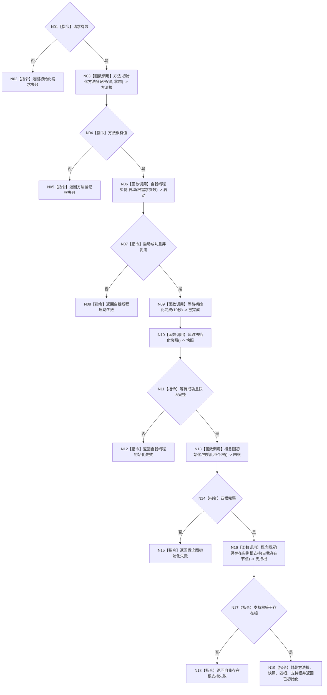

# ENTRY-ONLY F08 初始化普通系统

图类型：施工流程图
完整签名：`系统初始化结果 初始化普通系统(普通应用上下文& 上下文, const 系统初始化请求& 请求)`
归属：`海中鱼巣/领域/初始化.系统.ixx`；返回 T04。绑定规范 8120、详细设计第 7 节、计划。
允许：生产必要初始化；禁止重复/错误参数/删除/额外实例自检和 SQL/UI。结构变化：方法根、语素、世界树、根需求、四概念根、自我支持。复核 C02-C06；验证 V09-V12。不得宣称完整自检已运行。

| 节点 | 类型 | 结果绑定 |
| --- | --- | --- |
| N03 | 被调函数 | C05 -> T04.方法登记根 |
| N06/N09/N10 | 被调函数 | C02/C03/读取快照 -> T04.自我初始化 |
| N13 | 被调函数 | C04 -> T04.概念图 |
| N16 | 被调函数 | C06 -> T04.自我存在根支持 |
| 其余 | 指令 | 前置拒绝或后置条件追根因。 |

调用方 F06/F11/S01-S13；被调合同 C02-C06。
