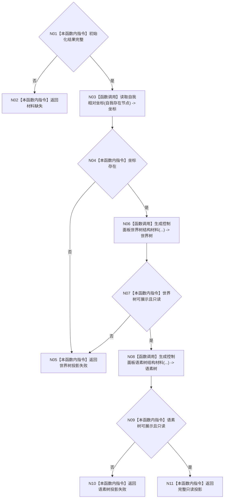

# ENTRY-ONLY F09 生成控制面板启动投影

更新时间：2026-07-26

## 依据

```text
规范/8120_子规范_程序入口启动模式与运行宿主边界_20260726.md
规范/详细设计/20260726_ENTRY-ONLY_入口职责单一化详细设计_v0.1.md
计划/20260726_ENTRY-ONLY_薄入口模式路由与初始化宿主分层代码实施计划_v0.1.md
```

## 身份与边界

正式施工流程图；只在本计划允许文件内实施。

## 函数合同

以下冻结元数据中的根函数、归属、参数、返回、允许/禁止范围和执行前复核共同构成本图函数合同。

图类型：施工流程图
完整签名：`控制面板启动投影结果 生成控制面板启动投影(const 普通应用上下文& 上下文, const 系统初始化结果& 初始化)`
归属：`海中鱼巣/界面/投影.控制面板启动.ixx`；返回 T05。绑定规范 8120、详细设计第 9 节、计划。
允许：只读上下文并复用现有 DTO；禁止结构写入、数据库和窗口。结构变化：无。复核迁移的 8 个私有投影函数；验证 V13。不得宣称投影是机器事实。

## 流程图



## 节点合同

| 节点 | 类型 | 分析 |
| --- | --- | --- |
| N01/N02 | 本函数内指令 | 核对 T04 五项完整；缺失返回 `初始化材料缺失`，零投影调用。 |
| N03 | 函数调用 | 自我存在节点调用 C27，绑定 `optional<世界树相对坐标> 坐标`。 |
| N04/N05 | 本函数内指令 | 坐标为空返回世界树投影失败。 |
| N06 | 函数调用 | 节点/关系/世界树/语素/坐标调用 F23，绑定世界树材料。 |
| N07 | 本函数内指令 | 核对世界树完整、可展示且不含写入口；失败进入 N05。 |
| N08 | 函数调用 | 语素和概念图初始化结果调用 F26，绑定语素树材料。 |
| N09/N10 | 本函数内指令 | 语素树不可展示返回语素树投影失败。 |
| N11 | 本函数内指令 | 仅在两树完整时返回 `控制面板投影状态::已形成`。 |

调用方 F06；被调函数为 M08 私有单责函数和现有坐标读取。

## 关键边界

图前冻结的允许/禁止范围、结构变化、验证和不得宣称条款均为本图关键边界。
