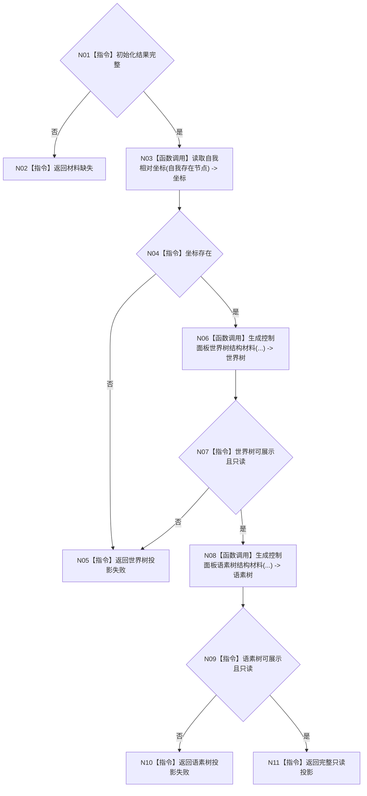

# ENTRY-ONLY F09 生成控制面板启动投影

图类型：施工流程图
完整签名：`控制面板启动投影结果 生成控制面板启动投影(const 普通应用上下文& 上下文, const 系统初始化结果& 初始化)`
归属：`海中鱼巣/界面/投影.控制面板启动.ixx`；返回 T05。绑定规范 8120、详细设计第 9 节、计划。
允许：只读上下文并复用现有 DTO；禁止结构写入、数据库和窗口。结构变化：无。复核迁移的 8 个私有投影函数；验证 V13。不得宣称投影是机器事实。

| 节点 | 类型 | 分析 |
| --- | --- | --- |
| N03/N06/N08 | 被调函数 | 现有读取或迁移私有函数；全部只读。 |
| 其余 | 指令 | 验证 DTO 后置条件。 |

调用方 F06；被调函数为 M08 私有单责函数和现有坐标读取。
