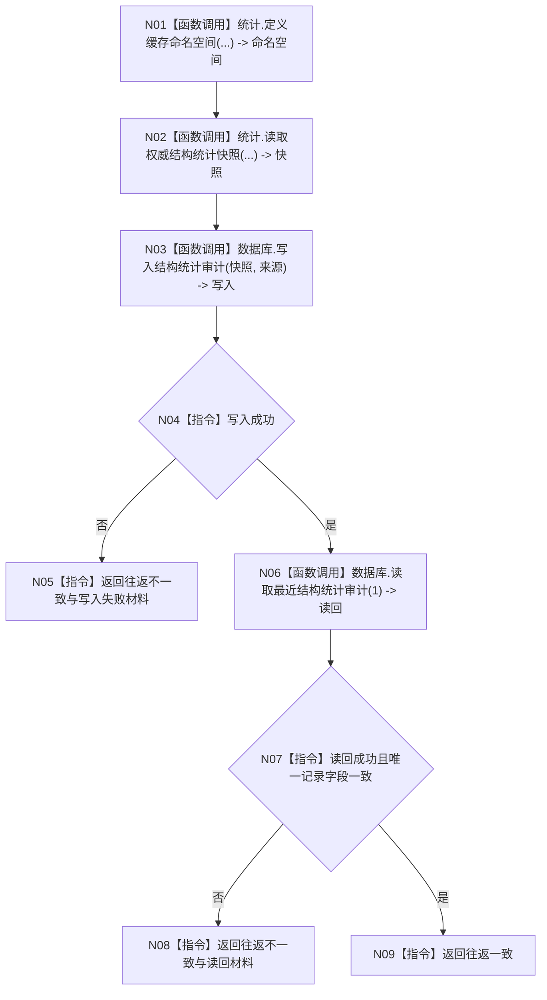

# ENTRY-ONLY F10 执行启动结构审计

图类型：施工流程图
完整签名：`数据库启动审计结果 执行启动结构审计(普通应用上下文& 上下文, 数据库审计要求 要求)`
归属：`海中鱼巣/适配/审计.数据库启动.ixx`；返回 T06。绑定规范 8120、详细设计第 10 节、计划。
允许：统计快照和 SQL 审计；禁止裁决领域初始化。结构变化：只写外部审计投影。复核 C07/C08；验证 V14-V16。不得宣称数据库是机器事实。

| 节点 | 类型 | 分析 |
| --- | --- | --- |
| N01-N03/N06 | 被调函数 | 统计只读，SQL 为非权威外部投影。 |
| N04/N07 | 指令 | 只计算 T06，不判断普通程序成功。 |
| N05/N08/N09 | 指令 | 返回结构化审计结果。 |

调用方 F06/F11；被调合同 C07/C08。
