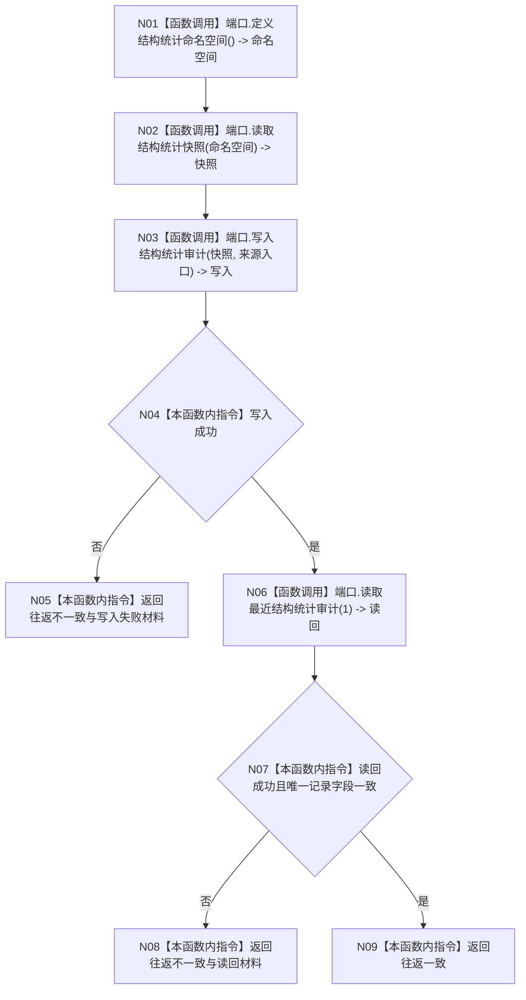

# ENTRY-ONLY F10 执行启动结构审计

更新时间：2026-07-26

## 依据

```text
规范/8120_子规范_程序入口启动模式与运行宿主边界_20260726.md
规范/详细设计/20260726_ENTRY-ONLY_入口职责单一化详细设计_v0.1.md
计划/20260726_ENTRY-ONLY_薄入口模式路由与初始化宿主分层代码实施计划_v0.1.md
```

## 身份与边界

正式施工流程图；只在本计划允许文件内实施。

## 函数合同

以下冻结元数据中的根函数、归属、参数、返回、允许/禁止范围和执行前复核共同构成本图函数合同。

图类型：施工流程图
完整签名：`数据库启动审计结果 执行启动结构审计(const 数据库启动审计端口& 端口, 数据库审计要求 要求)`
归属：`海中鱼巣/适配/审计.数据库启动.ixx`；返回 T06。绑定规范 8120、详细设计第 10 节、计划。
`数据库启动审计端口` 固定含四个非空回调：`定义命名空间`=C15、`读取统计快照`=C16、`写入审计`=C07、`读取最近审计`=C08。生产端口只捕获同一上下文；V14/V16 使用替身端口分别返回连接失败或字段不一致读回，不接触真实 SQL。
允许：统计快照和 SQL 审计；禁止裁决领域初始化。结构变化：只写外部审计投影。复核 C07/C08/C15/C16；验证 V14-V16。不得宣称数据库是机器事实。

## 流程图



## 节点合同

| 节点 | 类型 | 分析 |
| --- | --- | --- |
| N01 | 函数调用 | 七个固定枚举/版本参数绑定 C15 回调，结果绑定 `缓存命名空间`；无效命名空间进入 N05。 |
| N02 | 函数调用 | N01 命名空间绑定 C16 回调，生产端口捕获节点/关系/索引，结果绑定 `结构统计快照`。 |
| N03 | 函数调用 | 快照与 `要求.来源入口` 绑定 C07 回调，结果绑定 `数据库操作结果`。 |
| N04 | 本函数内指令 | 只判断 N03 结构化成功；失败进入 N05。 |
| N05 | 本函数内指令 | 封装写入失败、空读回和 `往返一致=false`；最佳努力与必须一致由调用方解释。 |
| N06 | 函数调用 | 数量上限 1 绑定 C08 回调，结果绑定 `数据库查询结果`。 |
| N07 | 本函数内指令 | 核对恰有一条记录，来源入口、节点数、关系数、索引数与快照完全相同。 |
| N08/N09 | 本函数内指令 | 分别返回读回不一致或往返一致的完整 T06；不判断领域初始化。 |

调用方 F06/F11；被调合同 C07/C08。

## 关键边界

图前冻结的允许/禁止范围、结构变化、验证和不得宣称条款均为本图关键边界。
