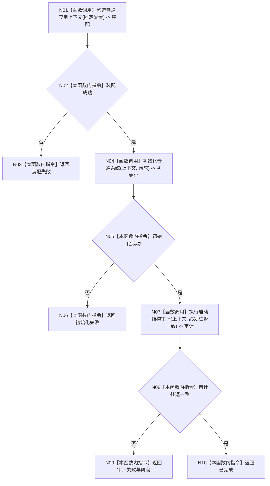

# ENTRY-ONLY F11 运行数据库专项

更新时间：2026-07-26

## 依据

```text
规范/8120_子规范_程序入口启动模式与运行宿主边界_20260726.md
规范/详细设计/20260726_ENTRY-ONLY_入口职责单一化详细设计_v0.1.md
计划/20260726_ENTRY-ONLY_薄入口模式路由与初始化宿主分层代码实施计划_v0.1.md
```

## 身份与边界

正式施工流程图；只在本计划允许文件内实施。

## 函数合同

以下冻结元数据中的根函数、归属、参数、返回、允许/禁止范围和执行前复核共同构成本图函数合同。

图类型：施工流程图
完整签名：`程序运行结果 运行数据库专项()`
归属：`海中鱼巣/启动.应用程序.ixx`；返回 T02。绑定规范 8120、详细设计 12.2、计划。
允许：F07/F08/F10 严格审计；禁止完整自检、投影和宿主。结构变化：生产必要初始化 + SQL 审计。执行前复核数据库可用性不属于入口前置；验证 V15-V16、V23。不得宣称普通启动依赖 SQL。

## 流程图



## 节点合同

| 节点 | 类型 | 分析 |
| --- | --- | --- |
| N01/N04/N07 | 被调函数 | 分别 F07/F08/F10。 |
| 其余 | 指令 | 严格专项映射；不进入宿主。 |

调用方 F04；被调图 F07/F08/F10。

## 关键边界

图前冻结的允许/禁止范围、结构变化、验证和不得宣称条款均为本图关键边界。
