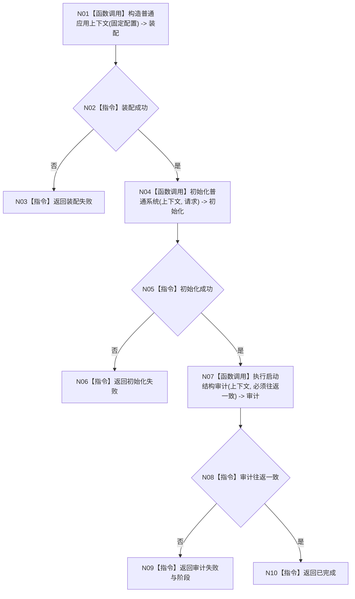

# ENTRY-ONLY F11 运行数据库专项

图类型：施工流程图
完整签名：`程序运行结果 运行数据库专项()`
归属：`海中鱼巣/启动.应用程序.ixx`；返回 T02。绑定规范 8120、详细设计 12.2、计划。
允许：F07/F08/F10 严格审计；禁止完整自检、投影和宿主。结构变化：生产必要初始化 + SQL 审计。执行前复核数据库可用性不属于入口前置；验证 V15-V16、V23。不得宣称普通启动依赖 SQL。

| 节点 | 类型 | 分析 |
| --- | --- | --- |
| N01/N04/N07 | 被调函数 | 分别 F07/F08/F10。 |
| 其余 | 指令 | 严格专项映射；不进入宿主。 |

调用方 F04；被调图 F07/F08/F10。
