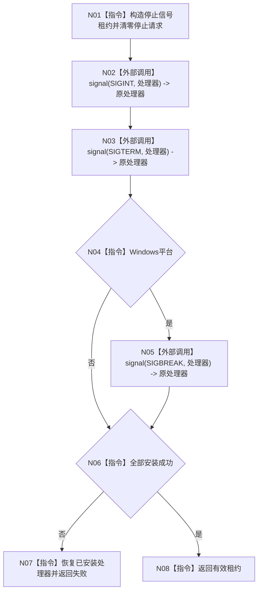

# ENTRY-ONLY F12 安装程序停止信号

图类型：施工流程图
完整签名：`停止信号安装结果 安装程序停止信号() noexcept`
归属：`海中鱼巣/启动.程序运行宿主.ixx`；返回 T07。绑定规范 8120、详细设计 11.1、计划。
允许：进程信号处理器；禁止领域写入和人读输出。结构变化：进程级信号处理器，可恢复。执行前复核平台宏；验证 V18-V19。不得宣称信号是动作来源。

| 节点 | 类型 | 分析 |
| --- | --- | --- |
| N01/N04/N06-N08 | 指令 | 租约所有权和失败恢复。 |
| N02/N03/N05 | 外部边界调用 | C `signal`；处理器仅置位。 |

调用方 F06；无项目被调函数。
