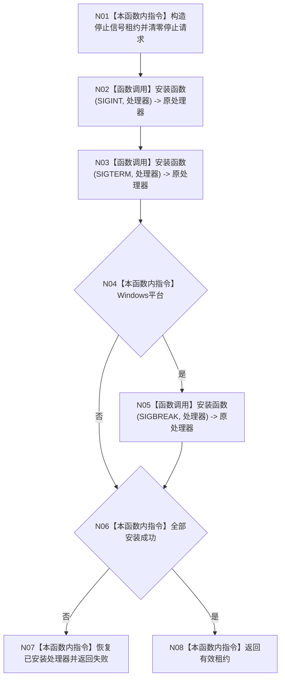

# ENTRY-ONLY F12 安装程序停止信号

更新时间：2026-07-26

## 依据

```text
规范/8120_子规范_程序入口启动模式与运行宿主边界_20260726.md
规范/详细设计/20260726_ENTRY-ONLY_入口职责单一化详细设计_v0.1.md
计划/20260726_ENTRY-ONLY_薄入口模式路由与初始化宿主分层代码实施计划_v0.1.md
```

## 身份与边界

正式施工流程图；只在本计划允许文件内实施。

## 函数合同

以下冻结元数据中的根函数、归属、参数、返回、允许/禁止范围和执行前复核共同构成本图函数合同。

图类型：施工流程图
完整签名：`停止信号安装结果 安装程序停止信号(程序信号安装函数 安装函数 = &std::signal) noexcept`
归属：`海中鱼巣/启动.程序运行宿主.ixx`；返回 T07。绑定规范 8120、详细设计 11.1、计划。
`程序信号处理函数 = void (*)(int)`；`程序信号安装函数 = 程序信号处理函数 (*)(int, 程序信号处理函数)`。生产调用使用默认 `std::signal`，V19 只向本参数传入确定失败的替身，不改变其它依赖。
允许：进程信号处理器；禁止领域写入和人读输出。结构变化：进程级信号处理器，可恢复。执行前复核平台宏和函数指针类型；验证 V18-V19。不得宣称信号是动作来源。

## 流程图



## 节点合同

| 节点 | 类型 | 分析 |
| --- | --- | --- |
| N01/N04/N06-N08 | 指令 | 租约所有权和失败恢复。 |
| N02 | 函数调用 | 调用 `安装函数(SIGINT, 处理器)`；参数绑定为 SIGINT 和模块私有处理器，结果绑定为租约的 SIGINT 原处理器；失败进入 N06。 |
| N03 | 函数调用 | 调用 `安装函数(SIGTERM, 处理器)`；结果绑定为租约的 SIGTERM 原处理器；失败时 N07 恢复已安装的 SIGINT。 |
| N05 | 函数调用 | 仅 Windows 调用 `安装函数(SIGBREAK, 处理器)`；结果绑定为租约的 SIGBREAK 原处理器；失败时 N07 逆序恢复前两项。 |

调用方 F06；无项目被调函数。

## 关键边界

图前冻结的允许/禁止范围、结构变化、验证和不得宣称条款均为本图关键边界。
