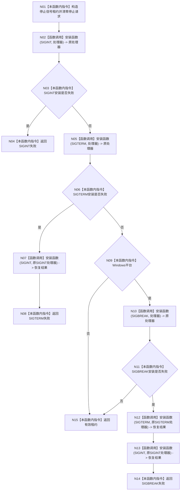

# ENTRY-ONLY F12 安装程序停止信号

更新时间：2026-07-26

## 依据

```text
规范/8120_子规范_程序入口启动模式与运行宿主边界_20260726.md
规范/详细设计/20260726_ENTRY-ONLY_入口职责单一化详细设计_v0.3.md
计划/20260726_ENTRY-ONLY_薄入口模式路由与初始化宿主分层代码实施计划_v0.3.md
```

## 身份与边界

正式施工流程图；只在本计划允许文件内实施。

## 函数合同

以下冻结元数据中的根函数、归属、参数、返回、允许/禁止范围和执行前复核共同构成本图函数合同。

图类型：施工流程图
完整签名：`停止信号安装结果 安装程序停止信号(程序信号安装函数 安装函数 = 程序信号安装函数{&std::signal}) noexcept`
归属：`海中鱼巣/启动.程序运行宿主.ixx`；返回 T07。绑定规范 8120、详细设计 11.1、计划。
`程序信号处理函数 = void (*)(int)`；`程序信号安装函数 = std::function<程序信号处理函数(int, 程序信号处理函数)>`。F12 按值取得并把端口移入租约；生产调用使用默认 `std::signal`。V19 传入捕获 F27 局部三槽序列和计数的替身，该替身第二次安装失败并在 F12 返回前完成第三次恢复调用，不进入成功租约。
允许：进程信号处理器；禁止领域写入和人读输出。结构变化：进程级信号处理器，可恢复。执行前复核 `<functional>`、平台宏、处理函数指针与可捕获安装端口类型；验证 V18-V19。不得宣称信号是动作来源。

## 流程图



## 节点合同

| 节点 | 类型 | 分析 |
| --- | --- | --- |
| N01/N03-N04/N06/N08-N09/N11/N14-N15 | 指令 | N01 拒绝空端口并把非空端口移动到新租约；每个判断或返回独占一个节点；失败返回前不发布租约。 |
| N02/N05/N10 | 函数调用 | 分别安装 SIGINT、SIGTERM、Windows SIGBREAK，并把原处理器绑定到租约对应槽位。 |
| N07 | 函数调用 | SIGTERM 安装失败后只恢复已经成功安装的 SIGINT。 |
| N12-N13 | 函数调用 | SIGBREAK 安装失败后按 SIGTERM、SIGINT 的逆序分别恢复；两个恢复调用不得合并。 |

调用方 F06；无项目被调函数。

## 关键边界

图前冻结的允许/禁止范围、结构变化、验证和不得宣称条款均为本图关键边界。端口行为不得抛异常；V19 的引用捕获只允许失败路径调用期间借用 F27 局部证据，禁止把该捕获带入成功租约。
