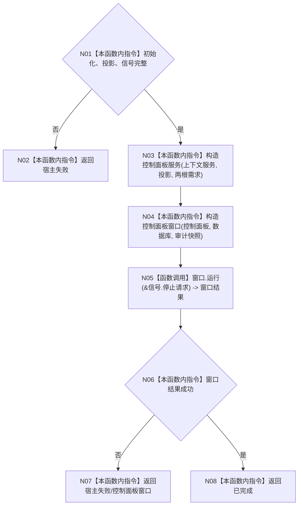

# ENTRY-ONLY F13 运行控制面板宿主

更新时间：2026-07-26

## 依据

```text
规范/8120_子规范_程序入口启动模式与运行宿主边界_20260726.md
规范/详细设计/20260726_ENTRY-ONLY_入口职责单一化详细设计_v0.1.md
计划/20260726_ENTRY-ONLY_薄入口模式路由与初始化宿主分层代码实施计划_v0.1.md
```

## 身份与边界

正式施工流程图；只在本计划允许文件内实施。

## 函数合同

以下冻结元数据中的根函数、归属、参数、返回、允许/禁止范围和执行前复核共同构成本图函数合同。

图类型：施工流程图
完整签名：`程序运行结果 运行控制面板宿主(普通应用上下文& 上下文, const 系统初始化结果& 初始化, const 控制面板启动投影结果& 投影, const 数据库启动审计结果& 审计, 停止信号租约& 信号)`
归属：`海中鱼巣/启动.程序运行宿主.ixx`；返回 T02。绑定规范 8120、详细设计 11.2、计划。
允许：只读服务与窗口生命周期；禁止业务结构写入。结构变化：无。复核 C09 构造/运行签名；验证 V17。不得宣称 UI 材料裁决事实。

## 流程图



## 节点合同

| 节点 | 类型 | 分析 |
| --- | --- | --- |
| N01/N02 | 本函数内指令 | 核对初始化、投影和信号租约完整；缺失返回宿主失败，零 UI 构造。 |
| N03 | 本函数内指令 | 以仍存活的上下文服务、只读投影和两根需求构造控制面板服务。 |
| N04 | 本函数内指令 | 以控制面板服务、数据库适配器和审计快照构造窗口；不写机器事实。 |
| N05 | 函数调用 | 调用 C09，参数只绑定 `&信号.停止请求`，结果绑定窗口结果。 |
| N06/N07 | 本函数内指令 | 窗口失败映射 `宿主失败/控制面板窗口`。 |
| N08 | 本函数内指令 | 窗口成功返回已完成；上下文、投影、审计和信号覆盖调用全程。 |

调用方 F06；被调合同 C09。

## 关键边界

图前冻结的允许/禁止范围、结构变化、验证和不得宣称条款均为本图关键边界。
