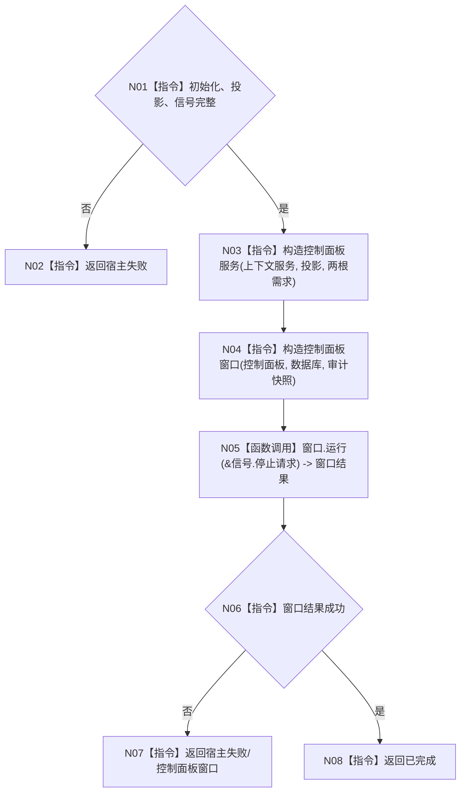

# ENTRY-ONLY F13 运行控制面板宿主

图类型：施工流程图
完整签名：`程序运行结果 运行控制面板宿主(普通应用上下文& 上下文, const 系统初始化结果& 初始化, const 控制面板启动投影结果& 投影, const 数据库启动审计结果& 审计, 停止信号租约& 信号)`
归属：`海中鱼巣/启动.程序运行宿主.ixx`；返回 T02。绑定规范 8120、详细设计 11.2、计划。
允许：只读服务与窗口生命周期；禁止业务结构写入。结构变化：无。复核 C09 构造/运行签名；验证 V17。不得宣称 UI 材料裁决事实。

| 节点 | 类型 | 分析 |
| --- | --- | --- |
| N03/N04 | 指令 | 构造对象，不生成新机器事实。 |
| N05 | 被调函数 | C09；停止指针只作宿主控制。 |
| 其余 | 指令 | 前置和结果映射。 |

调用方 F06；被调合同 C09。
