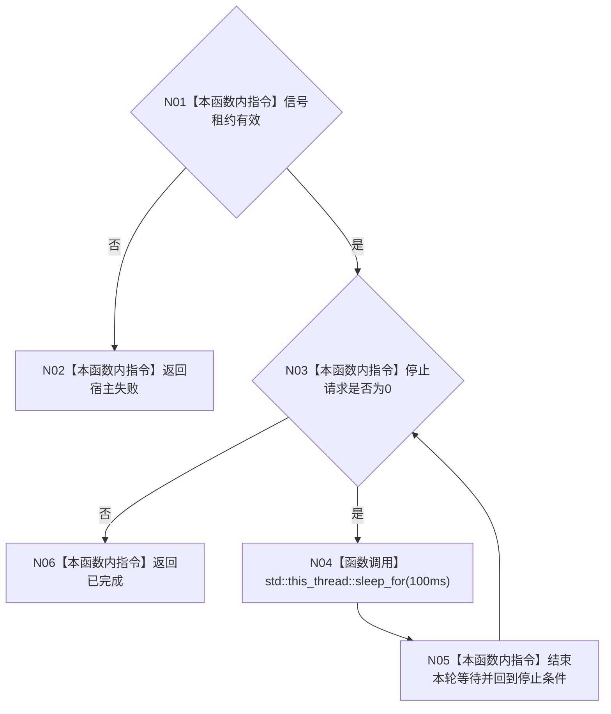

# ENTRY-ONLY F14 运行无窗口宿主

更新时间：2026-07-26

## 依据

```text
规范/8120_子规范_程序入口启动模式与运行宿主边界_20260726.md
规范/详细设计/20260726_ENTRY-ONLY_入口职责单一化详细设计_v0.1.md
计划/20260726_ENTRY-ONLY_薄入口模式路由与初始化宿主分层代码实施计划_v0.1.md
```

## 身份与边界

正式施工流程图；只在本计划允许文件内实施。

## 函数合同

以下冻结元数据中的根函数、归属、参数、返回、允许/禁止范围和执行前复核共同构成本图函数合同。

图类型：施工流程图
完整签名：`程序运行结果 运行无窗口宿主(普通应用上下文& 上下文, 停止信号租约& 信号)`
归属：`海中鱼巣/启动.程序运行宿主.ixx`；返回 T02。绑定规范 8120、详细设计 11.3、计划。
允许：等待信号；禁止控制面板投影、完整自检和 stdout。结构变化：无。执行前复核上下文生命周期覆盖循环；验证 V03/V18。不得宣称线程状态是机器事实。

## 流程图



## 节点合同

| 节点 | 类型 | 分析 |
| --- | --- | --- |
| N01-N03/N05-N06 | 指令 | 只读停止请求；N05 只形成循环回边；上下文因参数引用保持存活。 |
| N04 | 函数调用 | 调用 `void std::this_thread::sleep_for(const std::chrono::duration<Rep, Period>& 相对时间)` 的实例 `100ms`；无返回绑定，不承载动作来源。 |

调用方 F06；无项目被调函数。

## 关键边界

图前冻结的允许/禁止范围、结构变化、验证和不得宣称条款均为本图关键边界。
