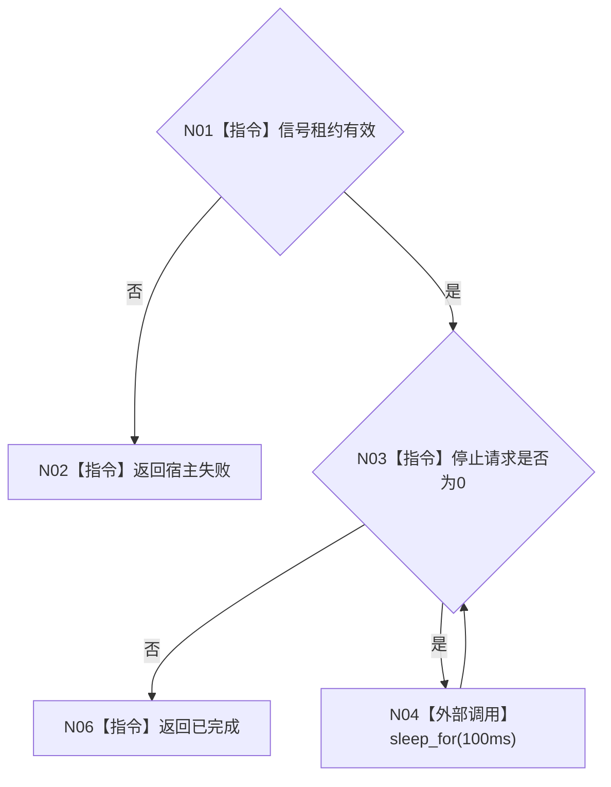

# ENTRY-ONLY F14 运行无窗口宿主

图类型：施工流程图
完整签名：`程序运行结果 运行无窗口宿主(普通应用上下文& 上下文, 停止信号租约& 信号)`
归属：`海中鱼巣/启动.程序运行宿主.ixx`；返回 T02。绑定规范 8120、详细设计 11.3、计划。
允许：等待信号；禁止控制面板投影、完整自检和 stdout。结构变化：无。执行前复核上下文生命周期覆盖循环；验证 V03/V18。不得宣称线程状态是机器事实。

| 节点 | 类型 | 分析 |
| --- | --- | --- |
| N01-N03/N06 | 指令 | 只读停止请求；上下文因参数引用保持存活。 |
| N04 | 外部边界调用 | 标准库等待，不承载动作来源。 |

调用方 F06；无项目被调函数。
