# ENTRY-ONLY F15 运行完整自检模式

更新时间：2026-07-26

## 依据

```text
规范/8120_子规范_程序入口启动模式与运行宿主边界_20260726.md
规范/详细设计/20260726_ENTRY-ONLY_入口职责单一化详细设计_v0.1.md
计划/20260726_ENTRY-ONLY_薄入口模式路由与初始化宿主分层代码实施计划_v0.1.md
```

## 身份与边界

正式施工流程图；只在本计划允许文件内实施。

## 函数合同

以下冻结元数据中的根函数、归属、参数、返回、允许/禁止范围和执行前复核共同构成本图函数合同。

图类型：施工流程图
完整签名：`程序运行结果 运行完整自检模式(const 入口初始化自检运行配置& 配置 = {})`
归属：`海中鱼巣/启动.应用程序.ixx`；返回 T02。绑定规范 8120、详细设计 13.3、计划。
`入口初始化自检运行配置` 只含 `optional<string> 强制失败编号`、`入口初始化自检观察回调* 观察回调`、`入口初始化批次观察回调* 批次观察回调` 与 `bool 跳过合同自检`；正常 CLI 使用空配置。强制失败只在对应 S 函数形成真实结果后把该项改为失败，用于 V22，不跳过其真实验证；两个观察回调只接收隔离地址/初始计数或最终批次证据，不改变结果。`跳过合同自检=true` 只允许 F28 的内层隔离批次使用，以避免 F28 递归登记自身。
允许：现有中央运行器固定登记 S01-S14，并在正常配置追加 F27/F28；禁止生产宿主、SQL专项、性能和D455。正常完整自检为 16 个顶层单元，其中入口初始化子集严格为 14；F28 内层为 14。结构变化：仅各回调隔离上下文。执行前复核固定编号/顺序；验证 V20-V23、V26-V28。不得宣称普通启动已自检。

## 流程图

```mermaid
flowchart TD
    N01["N01【本函数内指令】构造自检运行器"] --> N02["N02【函数调用】登记自检(10, ENTRY-ONLY-S01, 概念图四根创建, 回调S01配置)"]
    N02 --> N03["N03【函数调用】登记自检(20, ENTRY-ONLY-S02, 概念图四根唯一, 回调S02配置)"]
    N03 --> N04["N04【函数调用】登记自检(30, ENTRY-ONLY-S03, 概念图非名称身份, 回调S03配置)"]
    N04 --> N05["N05【函数调用】登记自检(40, ENTRY-ONLY-S04, 概念图根名绑定, 回调S04配置)"]
    N05 --> N06["N06【函数调用】登记自检(50, ENTRY-ONLY-S05, 重复初始化结构不变, 回调S05配置)"]
    N06 --> N07["N07【函数调用】登记自检(60, ENTRY-ONLY-S06, 自我存在实例根支持, 回调S06配置)"]
    N07 --> N08["N08【函数调用】登记自检(70, ENTRY-ONLY-S07, 多存在实例根支持, 回调S07配置)"]
    N08 --> N09["N09【函数调用】登记自检(80, ENTRY-ONLY-S08, 存在根支持拒绝, 回调S08配置)"]
    N09 --> N10["N10【函数调用】登记自检(90, ENTRY-ONLY-S09, 自我线程进入与初始化, 回调S09配置)"]
    N10 --> N11["N11【函数调用】登记自检(100, ENTRY-ONLY-S10, 语素与世界树快照读回, 回调S10配置)"]
    N11 --> N12["N12【函数调用】登记自检(110, ENTRY-ONLY-S11, 根需求稳定语义与特征定义, 回调S11配置)"]
    N12 --> N13["N13【函数调用】登记自检(120, ENTRY-ONLY-S12, 安全与服务根需求完整读回, 回调S12配置)"]
    N13 --> N14["N14【函数调用】登记自检(130, ENTRY-ONLY-S13, 自我线程重复启动结构不变, 回调S13配置)"]
    N14 --> N15["N15【函数调用】登记自检(140, ENTRY-ONLY-S14, 无效参数拒绝与生命周期, 回调S14配置)"]
    N15 --> N16{"N16【本函数内指令】配置.跳过合同自检"}
    N16 -- "否" --> N17["N17【函数调用】登记自检(150, SELFTEST-RUNNER-S1, 中央运行器合同, F27)"]
    N17 --> N18["N18【函数调用】登记自检(160, SELFTEST-RUNNER-S2, 阶段总成合同, F28)"]
    N16 -- "是" --> N19{"N19【本函数内指令】预期登记全部成功"}
    N18 --> N19
    N19 -- "否" --> R1["N20【本函数内指令】返回自检登记失败"]
    N19 -- "是" --> N21["N21【函数调用】运行器.运行全部() -> 批次"]
    N21 --> N22{"N22【本函数内指令】批次观察回调是否为空"}
    N22 -- "否" --> N23["N23【函数调用】(*配置.批次观察回调)(批次)"]
    N22 -- "是" --> N24["N24【本函数内指令-日志宏调用】记录批次调试摘要"]
    N23 --> N24
    N24 --> N25{"N25【本函数内指令】批次总通过且执行数符合配置"}
    N25 -- "否" --> R2["N26【本函数内指令】返回自检失败"]
    N25 -- "是" --> N27["N27【本函数内指令】返回已完成"]
```



## 节点合同

| 节点 | 类型 | 实现分析 |
| --- | --- | --- |
| N01 | 本函数内指令 | 构造一个空 `自检运行器`；不执行任何自检。 |
| N02-N15 | 函数调用 | 均调用 C17 完整签名；顺序固定 10..140，编号和名称按图逐项绑定，回调只调用对应 S 函数并传同一只读配置；返回依次写入 14 个登记 bool。 |
| N16 | 本函数内指令 | 只判断 `配置.跳过合同自检`；true 仅允许来自 F28。 |
| N17/N18 | 函数调用 | 正常配置依次以顺序 150/160 调用 C17 登记 F27/F28；F28 内层配置不执行这两个节点。 |
| N19 | 本函数内指令 | 跳过时核对前 14 个登记 bool；正常时核对全部 16 个，不使用汇总别名。 |
| N20 | 本函数内指令 | 返回失败阶段 `完整自检登记`，不调用 N21。 |
| N21 | 函数调用 | 无参数调用 C12，结果绑定 `自检批次结果 批次`；运行器保证单项失败不短路。 |
| N22 | 本函数内指令 | 只判断 `配置.批次观察回调` 是否为空；为空直接进入 N24。 |
| N23 | 函数调用 | 以 `const 自检批次结果&` 调用批次观察回调；回调声明 `noexcept`，只能复制测试证据。 |
| N24 | 本函数内指令 | 只把已经形成的批次摘要交给调试日志宏；宏关闭零求值，日志成功不参与 N25。 |
| N25 | 本函数内指令 | 正常配置核对登记/执行数 16；跳过配置核对 14；配置强制失败时还核对失败编号唯一命中。 |
| N26/N27 | 本函数内指令 | 分别把批次映射为 exit 1 或 exit 0 的 T02，保留结构化专项摘要。 |

调用方 F04/F28；回调被调图 S01-S14/F27/F28；直接被调合同 C12/C17。F28 回调进入 F15 时 `跳过合同自检=true`，因此不存在递归回边。

## 关键边界

图前冻结的允许/禁止范围、结构变化、验证和不得宣称条款均为本图关键边界。
