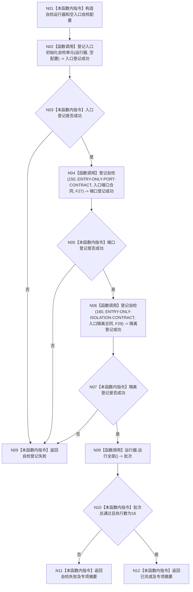

# ENTRY-ONLY F15 运行完整自检模式

更新时间：2026-07-26

## 依据

```text
规范/8120_子规范_程序入口启动模式与运行宿主边界_20260726.md
规范/详细设计/20260726_ENTRY-ONLY_入口职责单一化详细设计_v0.1.md
计划/20260726_ENTRY-ONLY_薄入口模式路由与初始化宿主分层代码实施计划_v0.1.md
```

## 身份与边界

正式施工流程图；只在本计划允许文件内实施。

## 函数合同

以下冻结元数据中的根函数、归属、参数、返回、允许/禁止范围和执行前复核共同构成本图函数合同。

图类型：施工流程图
完整签名：`程序运行结果 运行完整自检模式()`
归属：`海中鱼巣/启动.应用程序.ixx`；返回 T02。绑定规范 8120、详细设计 13.3、计划。
允许：创建现有中央运行器，以 F28 固定登记 S01-S14，再登记 F27/F29；禁止生产宿主、SQL专项、性能和D455。完整自检恰好 16 个顶层单元，其中入口初始化子集严格为 14。结构变化：仅各回调隔离上下文。执行前复核固定编号/顺序；验证 V20-V23、V26-V28。不得宣称普通启动已自检。

## 流程图



## 节点合同

| 节点 | 类型 | 实现分析 |
| --- | --- | --- |
| N01 | 本函数内指令 | 构造一个空 `自检运行器` 和默认空配置；不执行任何自检。 |
| N02 | 函数调用 | 调用 F28；F28 只登记 S01-S14，不运行批次。 |
| N03/N05/N07 | 本函数内指令 | 分别检查三段登记结果；任一失败进入 N09。 |
| N04/N06 | 函数调用 | 分别调用 C17，以 150/160 登记 F27/F29。 |
| N08 | 函数调用 | 无参数调用 C12，绑定 `自检批次结果 批次`；运行器保证单项失败不短路。 |
| N09 | 本函数内指令 | 返回失败阶段 `完整自检登记`，不运行批次。 |
| N10-N12 | 本函数内指令 | 核对执行数 16，并把批次映射为 exit 1/0 的 T02 专项摘要。 |

调用方 F04；被调图 F27-F29；直接被调合同 C12/C17。F15 不被 F27-F29 调用，中央运行器也不导入本模块，因此不存在递归或模块环。

## 关键边界

图前冻结的允许/禁止范围、结构变化、验证和不得宣称条款均为本图关键边界。
