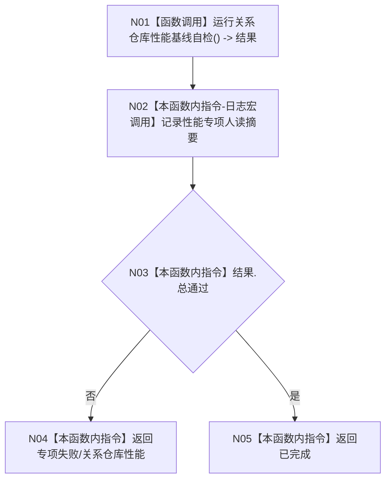

# ENTRY-ONLY F16 运行关系仓库性能专项

更新时间：2026-07-26

## 依据

```text
规范/8120_子规范_程序入口启动模式与运行宿主边界_20260726.md
规范/详细设计/20260726_ENTRY-ONLY_入口职责单一化详细设计_v0.1.md
计划/20260726_ENTRY-ONLY_薄入口模式路由与初始化宿主分层代码实施计划_v0.1.md
```

## 身份与边界

正式施工流程图；只在本计划允许文件内实施。

## 函数合同

以下冻结元数据中的根函数、归属、参数、返回、允许/禁止范围和执行前复核共同构成本图函数合同。

图类型：施工流程图
完整签名：`程序运行结果 运行关系仓库性能专项()`
归属：`海中鱼巣/启动.应用程序.ixx`；返回 T02。绑定规范 8120、详细设计 12.3、计划。
允许：调用现有性能自检和专项日志宏；禁止完整自检和普通装配。结构变化：仅专项隔离数据。复核 C10；验证 V24、V26-V28。不得宣称基准代表生产完成。

## 流程图



## 节点合同

| 节点 | 类型 | 分析 |
| --- | --- | --- |
| N01 | 被调函数 | C10；结构化结果先形成。 |
| N02 | 被调函数 | 具名宏，关闭不求值。 |
| N03-N05 | 指令 | 仅按 DTO 映射。 |

调用方 F04；被调合同 C10。

## 关键边界

图前冻结的允许/禁止范围、结构变化、验证和不得宣称条款均为本图关键边界。
