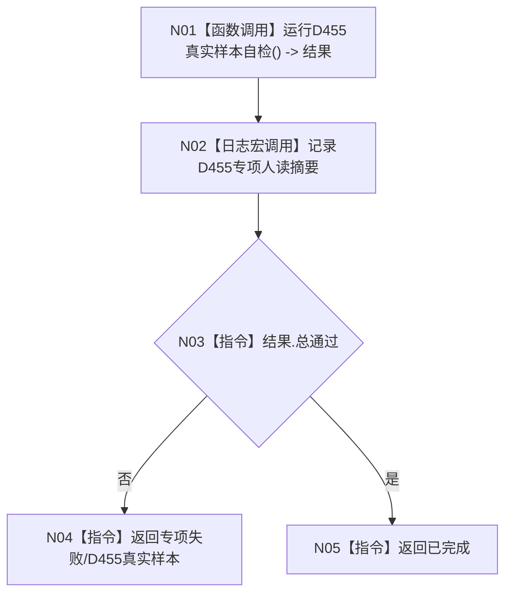

# ENTRY-ONLY F17 运行 D455 真实样本专项

图类型：施工流程图
完整签名：`程序运行结果 运行D455真实样本专项()`
归属：`海中鱼巣/启动.应用程序.ixx`；返回 T02。绑定规范 8120、详细设计 12.3、计划。
允许：调用现有真实样本自检和专项日志宏；禁止完整自检和普通装配。结构变化：仅专项采集材料。复核 C11 与构建宏；验证 V25-V28。不得宣称 D455 已进入生产闭环。

| 节点 | 类型 | 分析 |
| --- | --- | --- |
| N01 | 被调函数 | C11；必须真实构建能力已启用。 |
| N02 | 被调函数 | 具名宏，关闭不求值。 |
| N03-N05 | 指令 | 仅按专项 DTO 映射。 |

调用方 F04；被调合同 C11。
