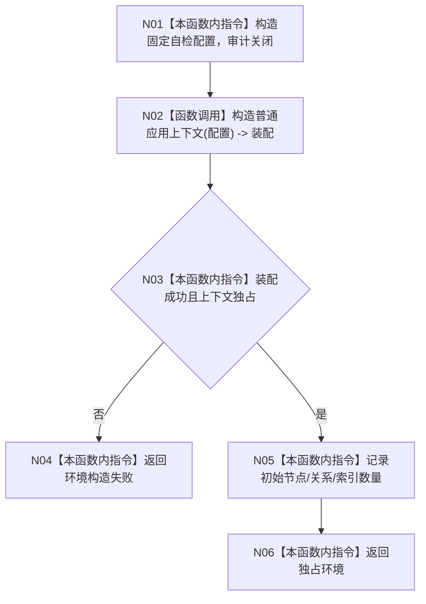

# ENTRY-ONLY F18 构造入口初始化自检环境

更新时间：2026-07-26

## 依据

```text
规范/8120_子规范_程序入口启动模式与运行宿主边界_20260726.md
规范/详细设计/20260726_ENTRY-ONLY_入口职责单一化详细设计_v0.1.md
计划/20260726_ENTRY-ONLY_薄入口模式路由与初始化宿主分层代码实施计划_v0.1.md
```

## 身份与边界

正式施工流程图；只在本计划允许文件内实施。

## 函数合同

以下冻结元数据中的根函数、归属、参数、返回、允许/禁止范围和执行前复核共同构成本图函数合同。

图类型：施工流程图
完整签名：`入口初始化自检环境构造结果 构造入口初始化自检环境()`
归属：`海中鱼巣/自检.入口初始化.ixx`；返回独占隔离环境。绑定规范 8120、详细设计 13.1、计划。
允许：调用 F07 创建全新上下文；禁止 SQL、投影、宿主和 static 共享。结构变化：新空隔离仓库对象。执行前复核配置禁用审计；验证 V21。不得宣称环境是生产上下文。

## 流程图



## 节点合同

| 节点 | 类型 | 分析 |
| --- | --- | --- |
| N01/N03-N06 | 指令 | 每次调用新对象；无全局缓存。 |
| N02 | 被调函数 | F07；只装配，不初始化。 |

调用方 S01-S14；被调图 F07。

## 关键边界

图前冻结的允许/禁止范围、结构变化、验证和不得宣称条款均为本图关键边界。
