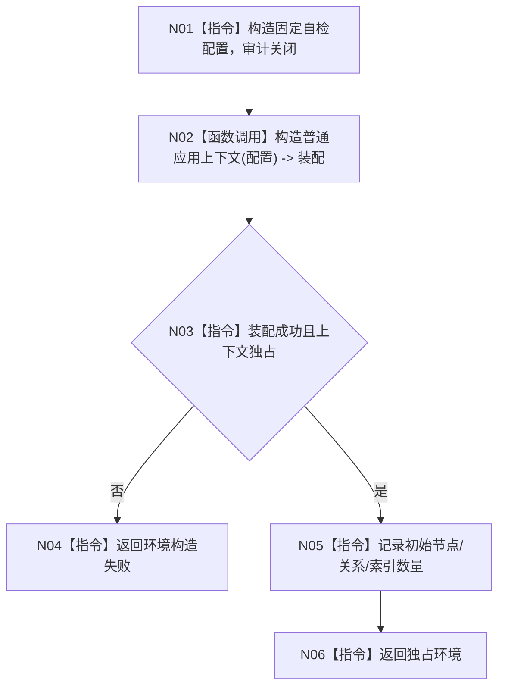

# ENTRY-ONLY F18 构造入口初始化自检环境

图类型：施工流程图
完整签名：`入口初始化自检环境构造结果 构造入口初始化自检环境()`
归属：`海中鱼巣/自检.入口初始化.ixx`；返回独占隔离环境。绑定规范 8120、详细设计 13.1、计划。
允许：调用 F07 创建全新上下文；禁止 SQL、投影、宿主和 static 共享。结构变化：新空隔离仓库对象。执行前复核配置禁用审计；验证 V21。不得宣称环境是生产上下文。

| 节点 | 类型 | 分析 |
| --- | --- | --- |
| N01/N03-N06 | 指令 | 每次调用新对象；无全局缓存。 |
| N02 | 被调函数 | F07；只装配，不初始化。 |

调用方 S01-S14；被调图 F07。
