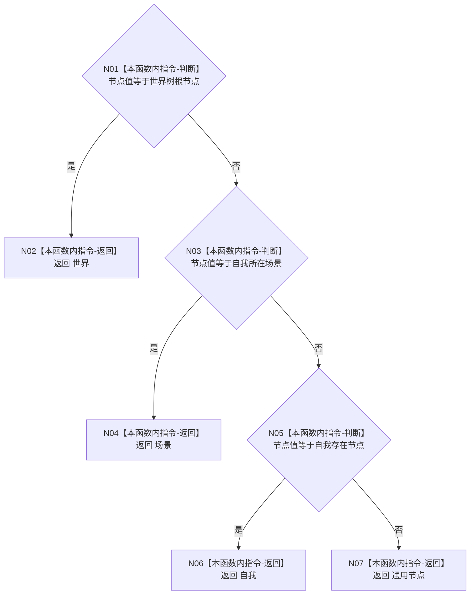

# ENTRY-ONLY F19 读取世界树节点名称角色施工流程图

更新时间：2026-07-26

## 依据

```text
规范/8120_子规范_程序入口启动模式与运行宿主边界_20260726.md
海中鱼巣/入口.cpp:124-137 @ cf3e12d2d57192ca0d99b3acbc6f7d3f3fa7dc43
规范/详细设计/20260726_ENTRY-ONLY_入口职责单一化详细设计_v0.1.md
```

## 身份与边界

施工流程图；只迁移当前只读投影判断，不写机器结构。

## 函数合同

```text
根函数：读取世界树节点名称角色
归属模块 / 文件 / 层级：海中鱼巣.界面.投影.控制面板启动 / 海中鱼巣/界面/投影.控制面板启动.ixx / 私有
现有或待新增：从入口匿名命名空间迁移
完整签名：世界树名称语素角色 读取世界树节点名称角色(节点句柄 节点值, const 世界树初始化结果& 初始化结果) noexcept
参数：节点值按值只读；初始化结果借用只读且调用期间有效
返回结果：四个枚举值之一；不产生失败或结构变化
被调函数流程图：无
```

## 流程图



## 节点合同

| 节点 | 类型 | 参数 / 输入绑定 | 结果 / 输出绑定 | 事实读写 | 后继条件 | 验证 |
| --- | --- | --- | --- | --- | --- | --- |
| N01/N03/N05 | 本函数内指令 | 节点值与初始化结果三个句柄 | 布尔分支 | 仅读值式材料 | 按图顺序首个匹配返回 | F19-V01 四类输入 |
| N02/N04/N06/N07 | 本函数内指令 | 已成立分支 | 对应枚举 | 无 | 终止 | F19-V01 |

## 关键边界

无效或未知句柄也只投影为“通用节点”；本函数不负责句柄合法性，调用者 F20/F22 先完成读取边界。
