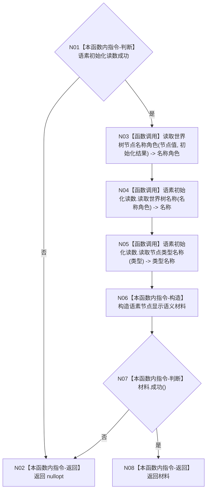

# ENTRY-ONLY F20 读取世界树节点显示语义施工流程图

更新时间：2026-07-26

## 依据

```text
规范/8120_子规范_程序入口启动模式与运行宿主边界_20260726.md
海中鱼巣/入口.cpp:139-155 @ cf3e12d2d57192ca0d99b3acbc6f7d3f3fa7dc43
```

## 身份与边界

施工流程图；形成非权威只读显示材料。

## 函数合同

```text
根函数：读取世界树节点显示语义
归属模块 / 文件 / 层级：海中鱼巣.界面.投影.控制面板启动 / 海中鱼巣/界面/投影.控制面板启动.ixx / 私有
现有或待新增：从入口匿名命名空间迁移
完整签名：std::optional<语素节点显示语义材料> 读取世界树节点显示语义(节点句柄 节点值, 节点类型 类型, const 世界树初始化结果& 初始化结果, const 语素初始化结果& 语素初始化读数)
参数：句柄和类型按值；两个结果借用只读且调用期间有效
返回结果：完整显示语义，或逻辑内空材料；零业务写入
被调函数流程图：F19
```

## 流程图



## 节点合同

| 节点 | 类型 | 参数 / 输入绑定 | 结果 / 输出绑定 | 事实读写 | 后继条件 | 验证 |
| --- | --- | --- | --- | --- | --- | --- |
| N01 | 本函数内指令 | 语素初始化读数 | 成功谓词 | 只读 | 成功继续 | F20-V01 |
| N02 | 本函数内指令 | 失败分支 | nullopt | 无 | 终止 | F20-V02 |
| N03 | 函数调用 | 节点值、初始化结果 | 名称角色 | 只读 | 调用完成 | F19-V01 |
| N04 | 函数调用 | 名称角色 | 名称显示项 | 只读值式结果 | 调用完成 | F20-V03 |
| N05 | 函数调用 | 类型 | 类型显示项 | 只读值式结果 | 调用完成 | F20-V03 |
| N06 | 本函数内指令 | 两显示项 | 材料 | 仅局部值 | 构造完成 | F20-V03 |
| N07 | 本函数内指令 | 材料 | 成功谓词 | 只读 | 分支 | F20-V03 |
| N08 | 本函数内指令 | 完整材料 | optional 有值 | 无 | 终止 | F20-V03 |

## 关键边界

调用节点与 F19 双向引用；两个语素读取是当前既有值式接口，不新增写入或修补路径。
