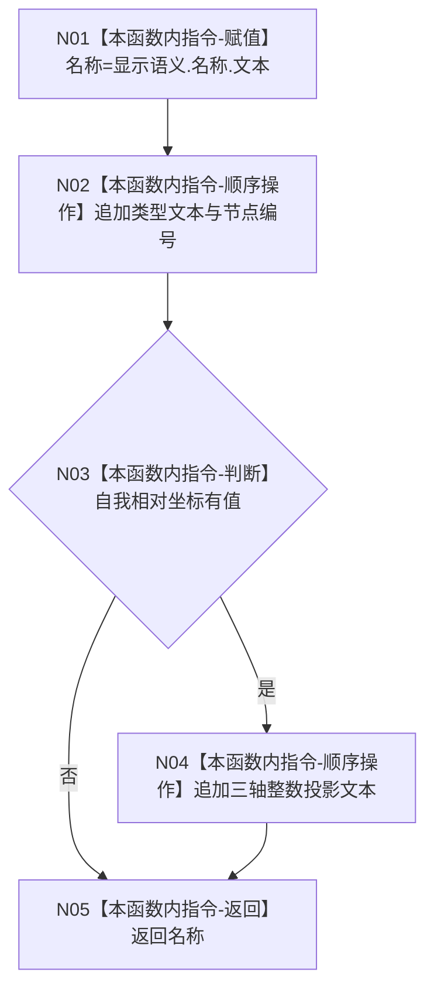

# ENTRY-ONLY F21 生成世界树节点显示名称施工流程图

更新时间：2026-07-26

## 依据

```text
规范/8120_子规范_程序入口启动模式与运行宿主边界_20260726.md
海中鱼巣/入口.cpp:157-176 @ cf3e12d2d57192ca0d99b3acbc6f7d3f3fa7dc43
```

## 身份与边界

施工流程图；只拼接人读显示文本，文本不承载机器事实。

## 函数合同

```text
根函数：生成世界树节点显示名称
归属模块 / 文件 / 层级：海中鱼巣.界面.投影.控制面板启动 / 海中鱼巣/界面/投影.控制面板启动.ixx / 私有
现有或待新增：从入口匿名命名空间迁移
完整签名：std::wstring 生成世界树节点显示名称(节点句柄 节点值, const 语素节点显示语义材料& 显示语义, const std::optional<世界树相对坐标>& 自我相对坐标)
参数：节点句柄按值；显示语义与可选坐标借用只读
返回结果：人读字符串；无机器结构变化
被调函数流程图：无；标准库数值转文本只记外部边界
```

## 流程图



## 节点合同

| 节点 | 类型 | 参数 / 输入绑定 | 结果 / 输出绑定 | 事实读写 | 后继条件 | 验证 |
| --- | --- | --- | --- | --- | --- | --- |
| N01 | 本函数内指令 | 显示语义.名称.文本 | 局部名称 | 无 | 继续 | F21-V01 |
| N02 | 本函数内指令 | 类型文本、节点编号 | 更新局部名称 | 无 | 继续 | F21-V01 |
| N03 | 本函数内指令 | optional 坐标 | 分支 | 无 | 有值追加 | F21-V02 |
| N04 | 本函数内指令 | 三轴值 | 更新局部名称 | 无；仅人读投影 | 继续 | F21-V02 |
| N05 | 本函数内指令 | 局部名称 | std::wstring | 无 | 终止 | F21-V01/F21-V02 |

## 关键边界

坐标按当前行为投影为整数加“.0”；不得用该文本反读坐标或裁决位置事实。
